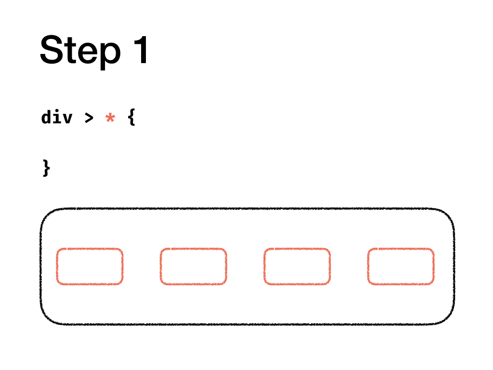
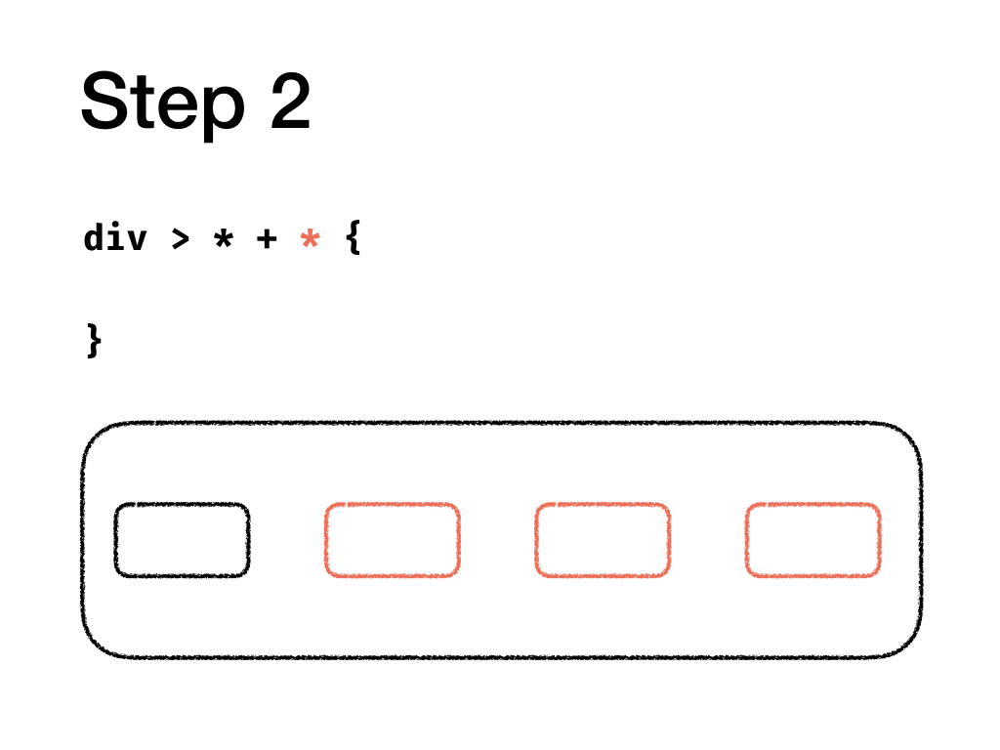
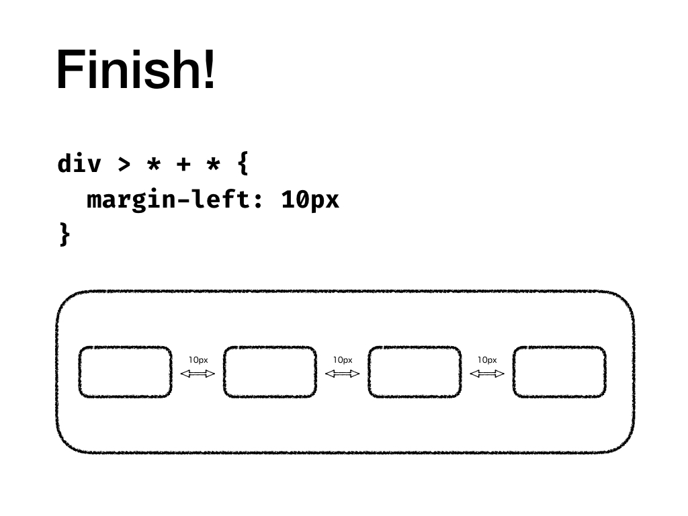

## Styled Components Recipe

如果你有使用 [Styled Components](https://www.styled-components.com/) 的話，可以把上面展示的邏輯抽成函式。

```js
export function gapHorizontal(value) {
  return `> * + * { margin-left: ${value}; }`
}

export function gapVertical(value) {
  return `> * + * { margin-top: ${value}; }`
}
```

接著只要簡單的一行就可以設定子元素的間距囉！

```js
const Container = styled.div`
  ${gapVertical('32px')}
`
```

## Further Reading

- `*` : [Universal Selector](https://drafts.csswg.org/selectors-3/#universal-selector)
- `>` : [Child Combinator](https://drafts.csswg.org/selectors-3/#child-combinators)

- `+` : [Next Sibling Combinator](https://drafts.csswg.org/selectors-3/#adjacent-sibling-combinators)
