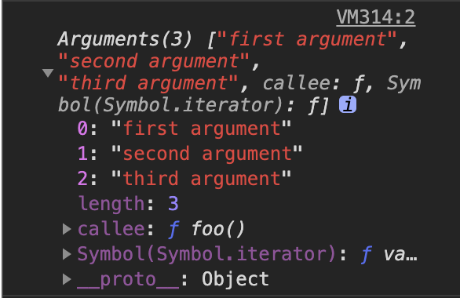

## 目錄
- [目錄](#目錄)
- [Arguments](#arguments)
- [Rest Operator](#rest-operator)
- [實戰應用](#實戰應用)
- [Reference](#reference)

## Arguments

最近閱讀許多開源 Source Code，常看到 [arguments](https://developer.mozilla.org/en-US/docs/Web/JavaScript/Reference/Functions/arguments) 這個東東。
一開始還滿困惑的點在於: 它既不是 Window 底下的屬性，也不是傳進 function 的參數。這個 arguments 到底是從哪裡來的啊？

根據 MDN 上的解釋：

arguments is an Array-like object accessible inside functions that contains the values of the arguments passed to that function.

簡單來說，`arguments` 就是一個能夠在 function 內存取的 **Array Like** Object，並且包含所有傳入這個 function 的參數值。

```js
function foo() {
  console.log(arguments)
}

foo('first argument', 'second argument', 'third argument')
```



Array-Like Object 有 Array 的屬性，但沒有 Array 的方法。

```js
console.log(arguments[0]) // first argument
console.log(arguments[1]) // second argument
console.log(arguments[2]) // third argument

// Uncaught TypeError: arguments.push is not a function
arguments.push('forth argument')
```

要把 `arguments` 轉換成 Array，可以用以下幾種方式：

```js
const arr = Array.prototype.slice.call(arguments)
const arr = [].slice.call(arguments)
const arr = Array.from(arguments)
const arr = [...arguments]
```

**注意！** 要使用 arguments 必須在 **function** 內使用，[Arrow Function](https://developer.mozilla.org/en-US/docs/Web/JavaScript/Reference/Functions/Arrow_functions) 中無法使用 arguments，

```js
const foo = () => {
  console.log(arguments) // Uncaught ReferenceError: arguments is not defined
}
```

## Rest Operator

The rest parameter syntax allows us to represent an indefinite number of arguments as an array.

```js
function myFun(a, b, ...manyMoreArgs) {
  console.log('a', a)
  console.log('b', b)
  console.log('manyMoreArgs', manyMoreArgs)
}

myFun('one', 'two', 'three', 'four', 'five', 'six')

// Console Output:
// a, one
// b, two
// manyMoreArgs, [three, four, five, six]
```

和 Arguments 比起來，使用 Rest Operator 的好處是

1. 不需要再轉換成 Array
2. 可以任意在 Arrow Function 中使用
3. ~~ES6 語法，就是比較潮~~

## 實戰應用

主要的應用場景在於無法確定傳入的參數個數時：

```js
const sum = (...args) => args.reduce((sum, value) => (sum += value), 0)

const max = (...args) =>
  args.reduce((max, value) => (value > max ? value : max))
```

將所有參數向下傳遞：

```js
const foo = (...args) {
  // 略
  bar(...args)
  // 略
}
```

## Reference

- [The arguments object - JavaScript | MDN](https://developer.mozilla.org/en-US/docs/Web/JavaScript/Reference/Functions/arguments)
- [Rest parameters - JavaScript | MDN](https://developer.mozilla.org/en-US/docs/Web/JavaScript/Reference/Functions/rest_parameters)
