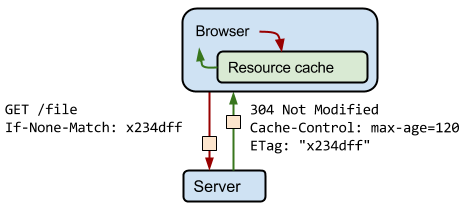

## Table of Contents

```toc
```

## Expires, Cache-Control, max-age

以下範例中 Expires 為了閱讀方便，格式有稍作修改 😜，實際上 Expires 的格式會像是這樣： `Expires: Wed, 21 Oct 2017 07:28:00 GMT`

### Case 1

假設現在時間 `2020-01-01 00:00:00`，Client 第一次請求 `index.html` 的資源，
Server 回應 Header：

```http
Cache-Control: max-age=3600
```

- 在 `2020-01-01 00:00:00` + 3600 秒 = `2020-01-01 01:00:00` 以前請求 `index.html`，瀏覽器都會直接拿 Cache 的資源，而不向 Server 發出 Request。
- `2020-01-01T01:00:00Z` 以後請求 `index.html`，會重新發出 request

### Case 2

Server 回應 Header：

```http
Expires: 2020-01-01 12:00:00
```

- 在 `2020-01-01 12:00:00` 以前請求 `index.html`，瀏覽器都會直接拿 Cache 的資源，而不向 Server 發出 Request。
- 在 `2020-01-01 12:00:00` 以後請求 `index.html`，會重新發出 request

### Case 3

Server 回應 Header：

```http
Expires: 2020-01-01 01:00:00
Cache-Control: max-age=7200
```

根據 [RFC2616](https://www.w3.org/Protocols/rfc2616/rfc2616-sec14.html#sec14.9.3): If a response includes both an Expires header and a max-age directive, the max-age directive overrides the Expires header, even if the Expires header is more restrictive

即使 Expires 的時間比 Cache-Control 的時間更早，但是這裏依然以 Cache-Control 的時間為準。

### 重點整理

- 還沒超過 Expire 或者是在 max-age 規定的期限，就直接從快取裡面拿資料。如果過期了就發送 Request 去跟 Server 拿新的資料。
- Expires 後面顯示具體時間，Cache-Control 後利用 max-age 指定時間間隔，單位為秒
- Cache-Control 會覆蓋掉 Expires，即使 Expires 的時間比 Cache-Control 的 max-age 更早

## Last-Modified, If-Modified-Since

Server Response

```http
Last-Modified: 2017-01-01 13:00:00
Cache-Control: max-age=31536000
```

### Case 1

一年內的請求都會利用 Browser 的 Cache。

### Case 2

經過一年後，Client 發出 Request

```http
GET /logo.png
If-Modified-Since: 2017-01-01 13:00:00
```

如果檔案在 `2017-01-01 13:00:00` 有再更改過，Server 就會再回一份新的檔案，並且設定 Cache：

```http
Last-Modified: 2017-07-01 13:00:00
Cache-Control: max-age=31536000
```

### Case 3

經過一年後，Client 發出 Request

```http
GET /logo.png
If-Modified-Since: 2017-01-01 13:00:00
```

如果檔案在 `2017-01-01 13:00:00` 以後沒有更改過，Server 會回應 `Status code: 304 (Not Modified)`，代表快取裡面的資源還能繼續沿用。

## Etag, If-None-Match

可以把 Etag 想成是這份檔案內容的 hash 值（但其實不是，但是原理相近），利用檔案內容更動與否來當作是否更新快取的條件。



## no-store, no-cache

Q: 如果我想要檔案有更動就能夠馬上得知該怎麼做呢？
A: 每次請求都問 Server 檔案是否有更動，如果有更動則回應新的資源，否則回應 `status code: 304 (Not Modified)`

### Example

```http
Cache-Control: max-age=0
Etag: 1234
```

或者

```http
Cache-Control: no-cache
Etag: 1234
```

完全不使用快取

```http
Cache-Control: no-store
```

### 重點整理

- **no-cache**: 每次都會發送 Request 去確認檔案是否更動
- **no-store**: 完全不使用快取

## Long Term Cache

參考：https://developers.google.com/web/fundamentals/performance/webpack/use-long-term-caching

Q: 有沒有辦法能夠甚至連請求都不發，但是卻能夠知道檔案已經更動了呢？
A: 將 Etag 的機制自己實作在檔名裡

### Example

現在許多網站都是採用 SPA 的架構搭配 Webpack 打包。前端只需要引入一個 JavaScript 的檔案：

```html
<!DOCTYPE html>
<html>
<head>
  <link rel='stylesheet' href='style.css'></link>
  <script src='script.js'></script>
</head>
<body>
  <!-- body is render by js -->
</body>
</html>
```

js 檔名加上 Hash:

```html
<!DOCTYPE html>
<html>
<head>
  <link rel='stylesheet' href='style.css'></link>
  <script src='script-fgi81ksdff.js'></script>
</head>
<body>
  <!-- body is render by js -->
</body>
</html>
```

JavaScript 的檔名變成：`script-fgi81ksdff.js`，其實就跟 Etag 一樣，都是代表這個檔案的 hash 值。然後我們把這個檔案的快取策略設成：

```http
Cache-Control: max-age=31536000。
```

這樣子這個檔案就會被快取住一年。一年之內都不會對這個 URL 發送新的 Request。

藉由把 Etag 的機制實作在 `index.html` 裡面，我們就達成了我們的目標：「只要檔案不更新，瀏覽器就不會發 Request，直接沿用快取。只要檔案一更新，瀏覽器就要立即抓取新的檔案」。原理就是針對不同的檔案採用不同的快取策略，並且直接用「更換 JavaScript 檔案」的方式強制瀏覽器重新下載。


## 總結

`Expires` 跟 `max-age` 是在負責看這個快取是不是「新鮮」，`Last-Modified`, `If-Modified-Since`, `Etag`, `If-None-Match` 是負責詢問這個快取能不能「繼續使用」，而 `no-cache` 與 `no-store` 則是代表到底要不要使用快取，以及應該如何使用。

## 待解決問題

- From Memory Cache vs From Disk Cache
- Cache Control Default Value
- BF Cache

## 參考資料

- [HTTP/1.1: Header Field Definitions](https://www.w3.org/Protocols/rfc2616/rfc2616-sec14.html#sec14.9.1)
- [Cache-Control - HTTP | MDN](https://developer.mozilla.org/en-US/docs/Web/HTTP/Headers/Cache-Control)
- [HTTP Caching  |  Web Fundamentals  |  Google Developers](https://developers.google.com/web/fundamentals/performance/optimizing-content-efficiency/http-caching?hl=en)
- [循序漸進理解 HTTP Cache 機制](https://blog.techbridge.cc/2017/06/17/cache-introduction/)
- [新手坑：讓人又愛又恨的 HTTP Caching - Frochu - Medium](https://medium.com/frochu/http-caching-3382037ab06f)

### Long Term Cache

- [Make use of long-term caching | Web Fundamentals | Google Developers](https://developers.google.com/web/fundamentals/performance/webpack/use-long-term-caching)
- [大公司里怎样开发和部署前端代码？ · Issue #6 · fouber/blog](https://github.com/fouber/blog/issues/6)