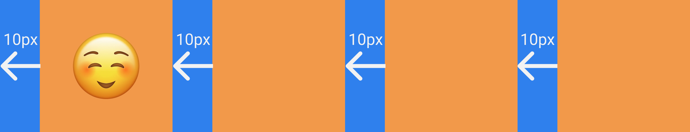
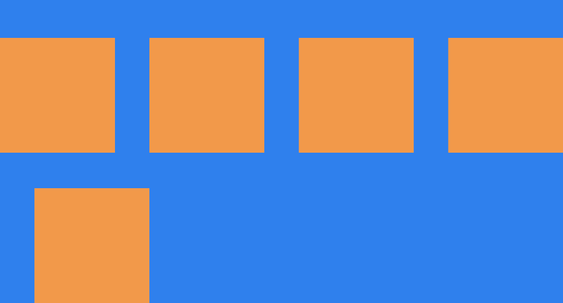
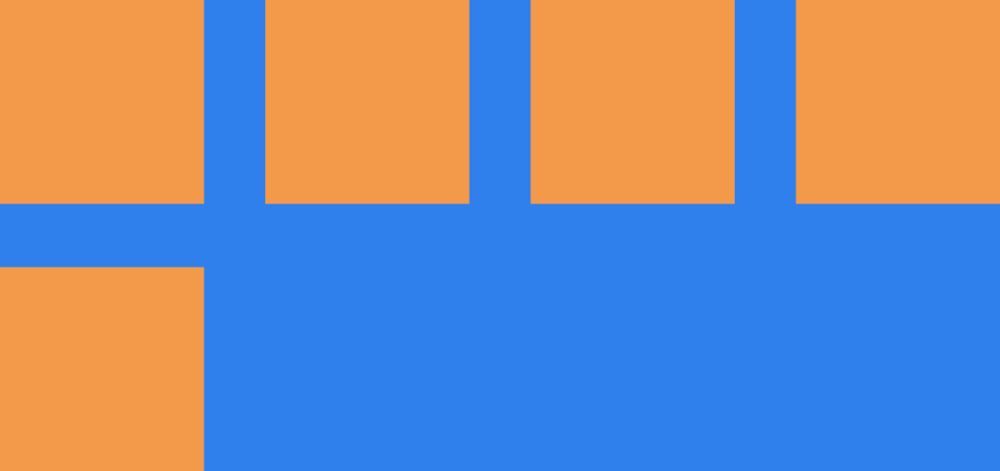

## Table of Contents

```toc

```

## 1. 撰文動機

指定子元素的間距應該是每個前端工程師都會遇到的問題，然而目前鮮少有文章提供簡單有效的解決方法。於是寫了這篇文章，紀錄如何利用 CSS 設定子元素間距，包含不需要換行的情境、使用 `flex-wrap` 換行的情境，以及舊瀏覽器不支援 `grid-gap` 時的 workaround。

## 2. 指定子元素間距

### 2.1 遭遇問題：調皮的 Margin

假設我們有一個外圍的父元素和內部的四個子元素：

```html
<div class="container">
  <div class="box"></div>
  <div class="box"></div>
  <div class="box"></div>
  <div class="box"></div>
</div>
```

接著我們希望 `box` 由左至右互相間隔 10px 該怎麼做呢？第一個思路可能會打算使用 `margin-left` 來解決：

```css
/* 僅留下本文討論重點，省略了部分樣式 */

.container {
  display: flex;
  flex-direction: row;
}

.box {
  margin-left: 10px;
}
```

結果發現最左邊這位小王八蛋製造了我們不希望達成的效果：



### 2.2 解決方法：CSS Selector、Combinator 打出組合技

在開始以前，我們先來熟悉一下這幾位好朋友：

- `*` : [Universal Selector](https://drafts.csswg.org/selectors-3/#universal-selector)
- `>` : [Child Combinator](https://drafts.csswg.org/selectors-3/#child-combinators)
- `+` : [Next Sibling Combinator](https://drafts.csswg.org/selectors-3/#adjacent-sibling-combinators)

第一步，我們希望 `box` class 的元素可以重複被利用，讓他擺在其他位置也能夠混得很好。所以最好不要把 `margin` 套用在 `box` class 上，而是交由外層的 `container` 來決定排版：

```css
.container > * {
  margin-left: 10px;
}
```

再來是我們要處理最左邊的元素，所以我們打算用 `+` 來選出**下面一位～**的元素：

```css
.container > * + * {
  margin-left: 10px;
}
```


這麼做就可以讓最左邊這小王八蛋乖乖閉嘴。

### 2.3 Bonus：Styled Component 食譜

如果你有使用 [Styled Components](https://www.styled-components.com/) 的話，可以把上面展示的邏輯抽成函式。

```js
export function gapHorizontal(value) {
  return `> * + * { margin-left: ${value}; }`
}

export function gapVertical(value) {
  return `> * + * { margin-top: ${value}; }`
}
```

接著只需簡單一行就可設定子元素的間距囉！

```js
const Container = styled.div`
  ${gapVertical('32px')}
`
```

## 3. Flex Wrap 換行的子元素間距

### 3.1 使用 Grid Gap 拉開你我的差距

假如說我今天使用 Flex Wrap 換行排版，並且也需要設定上下間隔的話，剛剛的套路就行不通了。

```css
.container {
  display: flex;
  flex-direction: row;
  flex-wrap: wrap;
}

.container > * {
  margin-top: 10px;
}

.container > * + * {
  margin-left: 10px;
}
```

結果如下：



造反了造反了，可以看到換行後的第一個元素一樣會有 `margin-left`，而且 `margin-top` 無法使用 `> * + *` 避開，使得上方多出了不想要的空間。那麼只能夠利用較為新潮的 CSS 屬性：[grid-gap](https://developer.mozilla.org/en-US/docs/Web/CSS/gap) 來解決了。

```css
.container {
  display: flex;
  flex-direction: row;
  flex-wrap: wrap;
  row-gap: 10px; /* 設定左右間距 */
  column-gap: 10px; /* 設定上下間距 */
}
```

子元素們都乖乖站好了：



### 3.2 舊瀏覽器的 Workaround

雖然 `grid-gap` 很好用，但是畢竟是比較新的語法，申購前應詳閱公開說明書 => [Can I use](https://caniuse.com/?search=gap)。若考量要支援較舊的瀏覽器，可使用以下 workaround：

```css
.container {
  --row-gap: 10px;
  --column-gap: 10px;
  flex-wrap: wrap;
  margin-top: calc(-1 * var(--column-gap));
  margin-left: calc(-1 * var(--row-gap));
  width: calc(100% + var(--row-gap));
}

.container > * {
  margin-left: var(--row-gap);
  margin-top: var(--column-gap);
}
```

簡單來說就是用父元素負數的 margin 來抵銷子元素外層的 margin，造成排版上就像是使用了 `grid-gap` 一樣的**錯覺**。不過如果 `.container` 有 `background-color` 的話然仍有可能穿幫。
