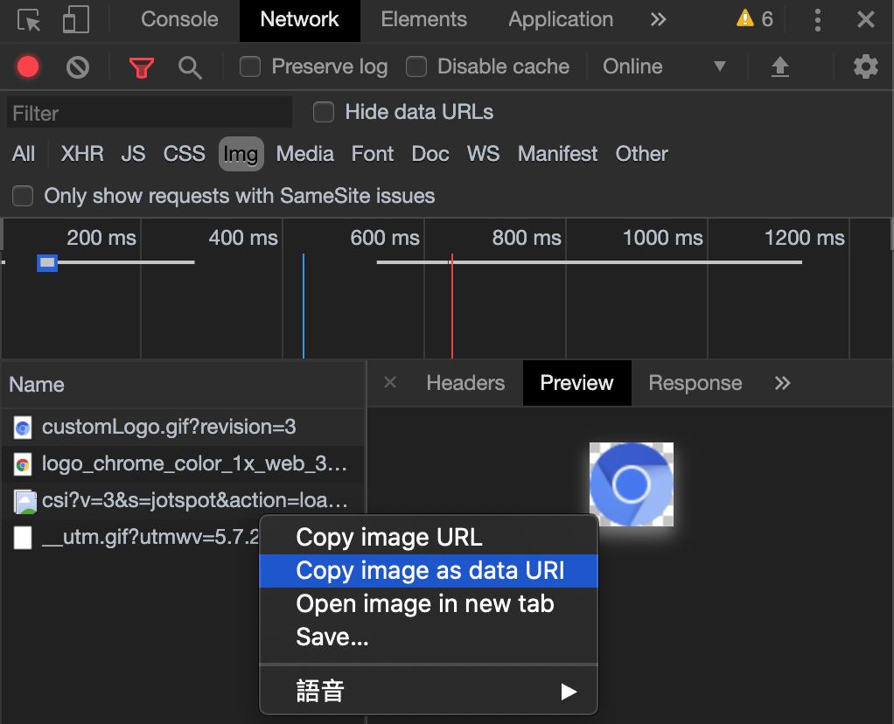

## Table of Contents

```toc
```

## 什麼是 Data URLs

根據 MDN 的定義： Data URLs, URLs prefixed with the data: scheme, allow content creators to embed small files inline in documents.

簡單的來說就是你可以直接把檔案**嵌入在網址中**，而不用再發 http request 向 server 索取檔案。

格式：

```http
data:[<mediatype>][;base64],<data>
```

mediatype 參考: [MIME types (IANA media types) - HTTP | MDN](https://developer.mozilla.org/en-US/docs/Web/HTTP/Basics_of_HTTP/MIME_types)

## 使用範例

小圖片通常會直接利用 Base64 加密後放在 Data URL，以節省 HTTP Request 來回時間：

```html

```

不過 Data URLs 也有缺點：

1. **沒有檔名**: 無法清出從字面得知檔案內容。
2. **Cache**: 所有的資料都是在網頁中，無法使用快取。
3. **重新編碼**: 當檔案資料有變化時，所有內嵌它的網頁都要重新產生編碼。
4. **大小**：base64 編碼後的檔案會比原始檔案大 **33%** 左右。

接下來我們透過 webpack 中的 file-loader 和 url-loader 來設定要不要使用 data URLS。

## Webpack file-loader & url-loader

[webpack](https://webpack.js.org/) 在處理檔案時，可以透過 [file-loader](https://github.com/webpack-contrib/file-loader) 進行處理, 而小檔案則可以透過 [url-loader](https://github.com/webpack-contrib/url-loader) 轉換成 base64 編碼格式後直接嵌入網頁中。file-loader 和 url-loader 有相依性，通常會一起搭配使用:

```js
module.exports = {
  module: {
    rules: [
      {
        test: [/\.gif$/, /\.jpe?g$/, /\.png$/],
        loader: 'url-loader',
        options: {
          limit: 10000,
          name: 'static/media/[name].[hash:8].[ext]'
        }
      },
      {
        test: [/\.svg$/, /\.ttf$/, /\.woff$/, /\.woff2$/, /\.eot$/],
        loader: 'file-loader',
        options: {
          name: 'static/media/[name].[hash:8].[ext]'
        }
      }
    ]
  }
}
```

- 若檔案副檔名為 `svg, ttf, woff, woff2, eot`: file-loader
- 若檔案副檔名為 `gif, jpe?g, png`，且檔案小於 Limit 參數的門檻: url-loader
- 若檔案副檔名為 `gif, jpe?g, png`，且檔案大於 Limit 參數的門檻: url-loader fallback to file-loader

## Bonus: 動手玩 base64 編碼

shell base64 commamnd:

```shell
$ echo -n "123" | base64      # MTIz
$ echo -n "MTIz" | base64 -D  # 123
```

Javascript 中可以透過 [btoa()](https://developer.mozilla.org/en-US/docs/Web/API/WindowOrWorkerGlobalScope/btoa) 和 [atob()](https://developer.mozilla.org/en-US/docs/Web/API/WindowOrWorkerGlobalScope/atob) 來進行 base64 轉換

```js
btoa('123') // MTIz
atob('MTIz') // 123
```

替圖片編碼：

```shell
$ base64 test.png
```

### URL

直接把網路上的圖片轉成 data url

<iframe
  src="https://codesandbox.io/embed/busy-cookies-owl80?fontsize=14&hidenavigation=1&theme=dark"
  style="width:100%; height:500px; border:0; border-radius: 4px; overflow:hidden;"
  title="busy-cookies-owl80"
  allow="accelerometer; ambient-light-sensor; camera; encrypted-media; geolocation; gyroscope; hid; microphone; midi; payment; usb; vr"
  sandbox="allow-forms allow-modals allow-popups allow-presentation allow-same-origin allow-scripts"
></iframe>

### Canvas

將 Canvas 轉成 data url 後下載下來

<iframe
  src="https://codesandbox.io/embed/fancy-fog-5lu88?fontsize=14&hidenavigation=1&theme=dark"
  style="width:100%; height:500px; border:0; border-radius: 4px; overflow:hidden;"
  title="fancy-fog-5lu88"
  allow="accelerometer; ambient-light-sensor; camera; encrypted-media; geolocation; gyroscope; hid; microphone; midi; payment; usb; vr"
  sandbox="allow-forms allow-modals allow-popups allow-presentation allow-same-origin allow-scripts"
></iframe>

### Form

Data url 有一個很實用的功能，就是作為上傳的預覽：

<iframe
  src="https://codesandbox.io/embed/charming-noyce-q1tbg?fontsize=14&hidenavigation=1&theme=dark"
  style="width:100%; height:500px; border:0; border-radius: 4px; overflow:hidden;"
  title="charming-noyce-q1tbg"
  allow="accelerometer; ambient-light-sensor; camera; encrypted-media; geolocation; gyroscope; hid; microphone; midi; payment; usb; vr"
  sandbox="allow-forms allow-modals allow-popups allow-presentation allow-same-origin allow-scripts"
></iframe>

## 小技巧

透過[開發工具](https://developers.google.com/web/updates/2015/05/copy-image-as-data-uri)的 Network 選取特定 Img Request，可以拷貝成 data URI 格式:



## 參考資料

- [RFC 2397 - The "data" URL scheme](https://tools.ietf.org/html/rfc2397)
- [Data URLs - HTTP | MDN](https://developer.mozilla.org/en-US/docs/Web/HTTP/Basics_of_HTTP/Data_URIs)
- [Data URI 前端優化 - cubemail88 - Medium](https://medium.com/cubemail88/data-uri-%E5%89%8D%E7%AB%AF%E5%84%AA%E5%8C%96-d83f833e376d)
- [使用 DATA URI 將圖片以 Base64 編碼並內崁至網頁中，加速載入速度 - G. T. Wang](https://blog.gtwang.org/web-development/minimizing-http-request-using-data-uri/)
- [實戰 Webpack 的 file-loader 和 url-loader - 《Chris 技術筆記》](https://dwatow.github.io/2018/12-29-webpack/action-url-loader-file-loader/)
- [How to convert image into base64 string using javascript - Stack Overflow](https://stackoverflow.com/questions/6150289/how-to-convert-image-into-base64-string-using-javascript)
- [利用 canvas 中 toDataURL()將圖片轉為 dataURL(base64)的方法詳解 | 程式前沿](https://codertw.com/%E5%89%8D%E7%AB%AF%E9%96%8B%E7%99%BC/227679/)
- [[JS] 透過 JavaScript 處理檔案上傳（AJAX Upload byte / JSON / formData File） ~ PJCHENder 那些沒告訴你的小細節](https://pjchender.blogspot.com/2019/01/js-javascript-input-file-upload-file.html)
