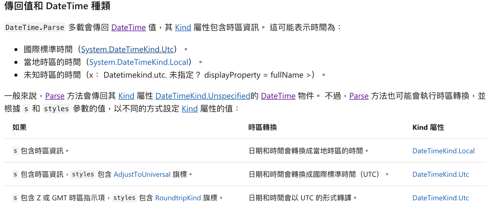
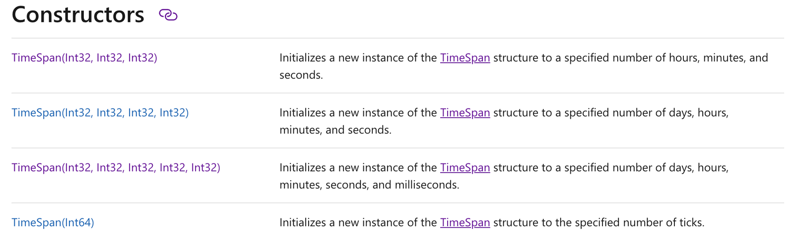

- [前言](#前言)
- [DateTime](#datetime)
  - [Constructor](#constructor)
  - [Kind](#kind)
  - [Now](#now)
  - [Parse](#parse)
  - [Get & Set](#get--set)
  - [Manipulate](#manipulate)
    - [Add & Subtract](#add--subtract)
    - [StartOf & EndOf](#startof--endof)
  - [Query](#query)
  - [Display](#display)
  - [Serialize](#serialize)
- [TimeSpan](#timespan)
  - [Construct/Parse](#constructparse)
    - [1. TimeSpan.Zero/TimeSpan()](#1-timespanzerotimespan)
    - [2. TimeSpan(int hours, int minutes, int seconds)](#2-timespanint-hours-int-minutes-int-seconds)
    - [3. Static Method](#3-static-method)
    - [4. By calling a method or performing an operation that returns a TimeSpan value](#4-by-calling-a-method-or-performing-an-operation-that-returns-a-timespan-value)
    - [5. Parsing from string](#5-parsing-from-string)
  - [Operation](#operation)
- [DateTimeOffset](#datetimeoffset)
  - [Construct](#construct)
  - [Convert to DateTime](#convert-to-datetime)
  - [Convert to Unix Timestamp](#convert-to-unix-timestamp)
  - [Parse](#parse-1)
  - [Manipulate](#manipulate-1)
  - [Query](#query-1)
  - [Display](#display-1)
  - [Serialize/Deserialize](#serializedeserialize)
- [gRPC Timestamp](#grpc-timestamp)
- [Reference](#reference)

# 前言

會寫這篇筆記的原因是，C# 官方對於 DateTime 的文件相當多，但是卻缺乏一個大方向的介紹，讓人很難入門不知道該從哪裡開始學起。

由於自己本身是比較擅長 Javascript 的開發者，
以下很多用法都會跟 Javascript 中的 [Date](https://developer.mozilla.org/en-US/docs/Web/JavaScript/Reference/Global_Objects/Date) 和 [Moment](https://momentjs.com/) 對照。
並且為了解說方便，Local 的時區以台北時區 +08:00 為準。

C# 中的時間主要有三個物件: DateTime, DateTimeOffset 和 TimeSpan，以下我們一一介紹：

# DateTime

## Constructor

指定年月日時分秒，以及 Kind

```csharp
new DateTime(2020, 12, 31, 23, 59, 59);  // Kind: Unspecified
new DateTime(2020, 12, 31, 23, 59, 59, DateTimeKind.Utc);  // Kind: Utc
new DateTime(2020, 12, 31, 23, 59, 59, DateTimeKind.Local);  // Kind: Local
```

## Kind

和 Javascript 中的 Date、Moment 不同的是，DateTime 有 Kind 這個屬性，表示這個時間代表哪個時區。例如：

```csharp
var localTime = new DateTime(2020, 1, 1, 0, 0, 0, DateTimeKind.Local);
d.Hours();  // 0
var utcTime = localTime.ToUniversalTime();  // Kind 轉為 Utc
d.Hours();  // 16 (減 8 小時)
```

```csharp
var utcTime = new DateTime(2020, 1, 1, 0, 0, 0, DateTimeKind.Utc);
d.Hours();  // 0
var localTime = utcTime.toLocalTime();  // Kind 轉為 Local
d.Hours();  // 8 (加 8 小時)
```

Kind 為 Unspecified 的 DateTime 比較特別

- toUtcTime 時會被當作 LocalTime，所以會 -8
- toLocalTime 時會被當作 UtcTime，所以會 +8

```csharp
var unspecifiedTime = new DateTime(2020, 1, 1, 0, 0, 0);  // Unspecified
unspecifiedTime.Hours()  // 0

var utcTime = unspecifiedTime.toUtcTime();
utcTime.Hours();  // 16

var LocalTime = unspecifiedTime.toLocalTime();
localTime.Hours();  // 8
```

## Now

```csharp
DateTime.Now  // Kind: Local
DateTime.UtcNow  // Kind: Utc
```

## Parse

https://docs.microsoft.com/en-us/dotnet/api/system.datetime.parse?view=netcore-3.1

Parse 後 DateTime Kind:



```csharp
DateTime.Parse("2020-01-01T00:00:00");  // Kind: Unspecified
DateTime.Parse("2020-01-01T00:00:00+08:00");  // Kind: Local
DateTime.Parse("2020-01-01T00:00:00Z");  // Kind: Local, 2020-01-01T08:00:00+08:00
DateTime.Parse("2020-01-01T00:00:00", null, DateTimeStyles.AdjustToUniversal);  // Kind: Unspecified
DateTime.Parse("2020-01-01T00:00:00Z", null, DateTimeStyles.AdjustToUniversal);  // Kind: Utc
```

## Get & Set

```csharp
var t = new DateTime(2020, 1, 1);

Console.WriteLine(t.Year);
Console.WriteLine(t.Month);
Console.WriteLine(t.Second);
// ....
```

⚠️ csharp 的 DateTime 沒辦法和 Js 的 Date 或 Moment 一樣，可以直接修改時間。

```csharp
var t = new DateTime(2020, 1, 1);
t.Year = 2019;  // 這樣會報錯！

var t1 = new DateTime(2020, 1, 1);
var t2 = new DateTime(2019, d.Month, d.Day);
```

## Manipulate

### Add & Subtract

可以加上 TimeSpan

```csharp
var t1 = new DateTime(2020, 1, 1);
var t2 = d.AddSeconds(32);
var t3 = d.AddYears(1);
var t4 = d.Add(new TimeSpan(10, 10, 10))
```

相減得到 TimeSpan

```csharp
var d1 = new DateTime(2019, 1, 1);
var d2 = new DateTime(2020, 1, 1);
var interval = d2 - d1;
Console.WriteLine(interval.Days);  // 365
```

### StartOf & EndOf

DateTime 沒辦法和 moment 一樣直接求出 startOf 和 endOf。但是我們能夠用 Extension Methods 擴充:

```csharp
public static DateTime StartOfDay(this DateTime date)
{
    return date.Date;
}

public static DateTime EndOfDay(this DateTime date)
{
    return date.AddDays(1).AddTicks(-1);
}
```

## Query

[DateTime.Compare(DateTime, DateTime) 方法 (System) | Microsoft Docs](https://docs.microsoft.com/zh-tw/dotnet/api/system.datetime.compare?view=netcore-3.1)


為了判斷 `t1` 與 `t2`的關聯性，[Compare](https://docs.microsoft.com/zh-tw/dotnet/api/system.datetime.compare?view=netcore-3.1) 方法會比較 `t1` 和 `t2` 的 [Ticks](https://docs.microsoft.com/zh-tw/dotnet/api/system.datetime.ticks?view=netcore-3.1) 屬性，
但會忽略其 Kind 屬性。在比較 DateTime 物件之前，請確定物件代表相同時區的時間。

```csharp
var t1 = new DateTime(2020, 1, 1);
var t2 = new DateTime(2020, 1, 2);
Console.WriteLine(DateTime.Compare(t1, t2) ? "Before" : "After")  // Before
```

## Display

```csharp
var now = DateTime.Now;
Console.WriteLine(now.toString('O'))  // ISO 8601 Format
Console.WriteLine(now.toString('R'))  // RFC 1123 Format
Console.WriteLine(now.ToString("yyyy-MM-dd"));  // Customize Format
```

⚠️ 注意 y 和 d 不可以是大寫，在 C# 的 DateTime 裡會 Format 不出來。

## Serialize

System.Text.Json 預設會轉為 ISO8601 的格式

```csharp
Console.WriteLine(JsonSerializer.Serialize(DateTime.UtcNow)); // 2020-05-03T10:48:51.498152Z
```

客製化方法參考: [System.Text.Json 中的 DateTime 和 DateTimeOffset 支援 | Microsoft Docs](https://docs.microsoft.com/zh-tw/dotnet/standard/datetime/system-text-json-support#the-extended-iso-8601-12019-profile-in-systemtextjson)

# TimeSpan

[TimeSpan 結構 (System) | Microsoft Docs](https://docs.microsoft.com/zh-tw/dotnet/api/system.timespan?view=netcore-3.1)

TimeSpan 代表時間的間隔

## Construct/Parse

### 1. TimeSpan.Zero/TimeSpan()

```csharp
TimeSpan interval = new TimeSpan();
Console.WriteLine(interval.Equals(TimeSpan.Zero));  // True
```

### 2. TimeSpan(int hours, int minutes, int seconds)

```C$
TimeSpan interval = new TimeSpan(2, 14, 18);
Console.WriteLine(interval.ToString());  // "02:14:18"
```



### 3. Static Method

```csharp
TimeSpan.FromDays(1)
TimeSpan.FromHours(24)
TimeSpan.FromSeconds(14400)
// ....
```

### 4. By calling a method or performing an operation that returns a TimeSpan value

```csharp
var d1 = new DateTime(2020, 1, 1);
var d2 = new DateTime(2020, 1, 1, 12, 12, 12);
var interval = d2 - d1;
Console.WriteLine(interval.Days); // 365
Console.WriteLine(interval.TotalDays); // 365.5084722222222
```

### 5. Parsing from string

```csharp
var interval = TimeSpan.Parse("5.8:32:16");
Console.WriteLine(interval.ToString()); // 5.08:32:16
```

## Operation

```csharp
var interval1 = TimeSpan.Parse("3:2:4");
var interval2 = new TimeSpan(2, 1, 1);
var interval3 = interval1 + interval2;
Console.WriteLine(interval3); // 05:03:05

var result = new DateTime(2020, 1, 1) + interval3;
Console.WiteLine(result.ToString("O"));  // 2020-01-01T05:03:05.0000000
```

# DateTimeOffset

> The [DateTimeOffset](https://docs.microsoft.com/en-us/dotnet/api/system.datetimeoffset?view=netcore-3.1) structure includes a DateTime value,
> together with an [Offset](https://docs.microsoft.com/en-us/dotnet/api/system.datetimeoffset.offset?view=netcore-3.1) property that defines the difference between the current DateTimeOffset instance's date and time and Coordinated Universal Time (UTC).
> Because it exactly defines a date and time relative to UTC, the DateTimeOffset structure does not include a Kind member,as the DateTime structure does.

## Construct

[Converting between DateTime and DateTimeOffset | Microsoft Docs](https://docs.microsoft.com/en-us/dotnet/standard/datetime/converting-between-datetime-and-offset#conversions-from-datetime-to-datetimeoffset)

```csharp
new DateTimeOffset(2020, 1, 1, 0, 0, 0, TimeSpan.Zero);
new DateTimeOffset(2020, 1, 1, 0, 0, 0, new TimeSpan(8, 0, 0);
```

From DateTime

```csharp
new DateTimeOffset(new DateTime(2020, 1, 1, 0, 0, 0), new TimeSpan(8, 0, 0));  // offset: +08:00:00
new DateTimeOffset(new DateTime(20202, 1, 1, 0, 0, 0));  // offset: +08:00:00, local
new DateTimeOffset(new DateTime(2020, 1, 1, 0, 0, 0, DateTimeKind.Utc));  // offset: 0
new DateTimeOffset(new DateTime(2020, 1, 1, 0, 0, 0, DateTimeKind.Local));  // offset: +08:00:00
```

Implicit Conversion

```csharp
DateTimeOffset t = new DateTime(2020, 1, 1, 0, 0, 0);
```

## Convert to DateTime

DateTimeOffset 有 DateTime 這個 property，不過這個 dateTime 的 Kind 是 `Unspecified`，所以不建議使用。比較好的方法是透過 `UtcDateTime` 和 `LocalDateTime` 這兩個 property 來得到 DateTime

```csharp
var tf = new DateTimeOffset(2020, 1, 1, 8, 0, 0, new TimeSpan(8, 0, 0));
tf.DateTime;   // 2020-01-01T08:00:00, Kind: Unspecified
tf.LocalDateTime;  //  2020-01-01T08:00:00, Kind: Local
tf.UtcDateTime;  // 2020-01-01T:00:00:00, Kind: Utc
```

## Convert to Unix Timestamp

```csharp
DateTimeOffset.Now.ToUnixTimeMilliseconds(); // 1588500202334
DateTimeOffset.Now.ToUnixTimeSeconds(); // 1588500202
```

## Parse

⚠️ 沒給予時區資訊會使用 Local Offset

```csharp
DateTimeOffset.Parse("2020-01-01T00:00:00Z");  // Offset: 0
DateTimeOffset.Parse("2020-01-01T00:00:00");  // default local time offset, Offset: 8 hours
DateTimeOffset.Parse("2020-01-01T00:00:00+06:00");  // 2020-01-01T00:00:00, Offset: 6 hours
```

## Manipulate

- 和 DateTime 大同小異，不過要注意相減時會把 Offset 的差納入計算。
- 沒有 Kind。

使用 `ToOffset` 來切換時區

```csharp
DateTimeOffset.UtcNow.ToOffset(TimeSpan.FromHours(8));
```

## Query

同 DateTime

## Display

同 DateTime

## Serialize/Deserialize

同 DateTime

# gRPC Timestamp

- [Protobuf 時間屬性該如何表示？ - Yowko's Notes](https://blog.yowko.com/protobuf-datetime-timestamp/)
- [Google.Protobuf.WellKnownTypes.Timestamp Class Reference](https://developers.google.com/protocol-buffers/docs/reference/csharp/class/google/protobuf/well-known-types/timestamp)

在傳送端，需要把 DateTime 轉為 Timestamp 再送出
⚠️ DateTimeKind 必須為 Utc

```csharp
timeStamp.FromDateTime(DateTime.UtcNow)
```

在接收端，需要把 Timestamp 再轉為 DateTime
⚠️ 轉出的 DateTime 其 Kind 必為 Utc

```csharp
timeStamp.toDateTime()
```

利用 DateTime Helper 裡面的 Extension Method

```csharp
public static Timestamp ToTimestamp(DateTime? dateTime)
{
    return dateTime.HasValue ? Timestamp.FromDateTime(dateTime.Value) : null;
}

public static NullableTimestamp ToNullableTimestamp(DateTime? dateTime)
{
    return dateTime.HasValue ? new NullableTimestamp {Data = ToTimestamp(dateTime)} : null;
}

public static DateTime? ToNullableDateTime(Timestamp timestamp)
{
    return timestamp?.Seconds > 0 ? timestamp.ToDateTime() : (DateTime?) null;
}

public static DateTime? ToNullableDateTime(NullableTimestamp timestamp)
{
    return timestamp?.Data?.ToDateTime();
}
```

# Reference

[Dropbox paper - C# 的時間管理術](https://paper.dropbox.com/doc/C-vRvh1MCurLWO2ji6tNqZD#:uid=911677147198949746518556&h2=Now)
