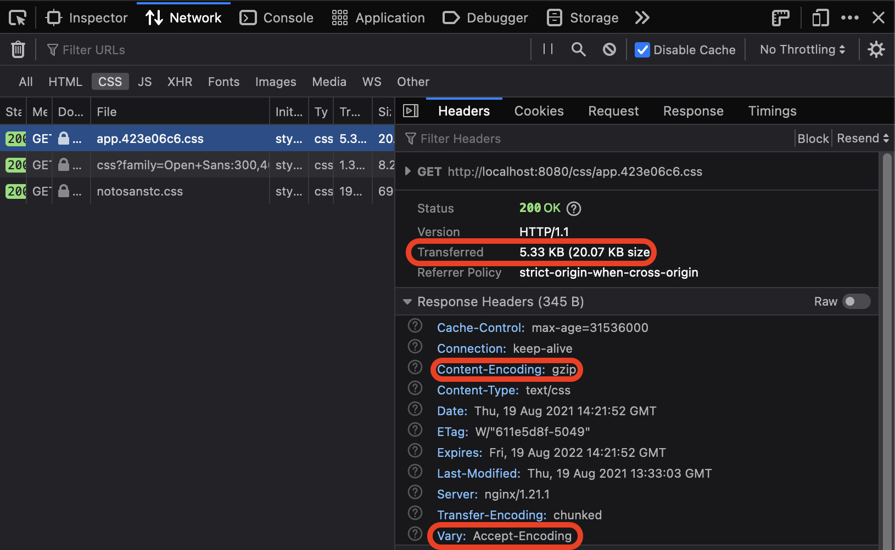
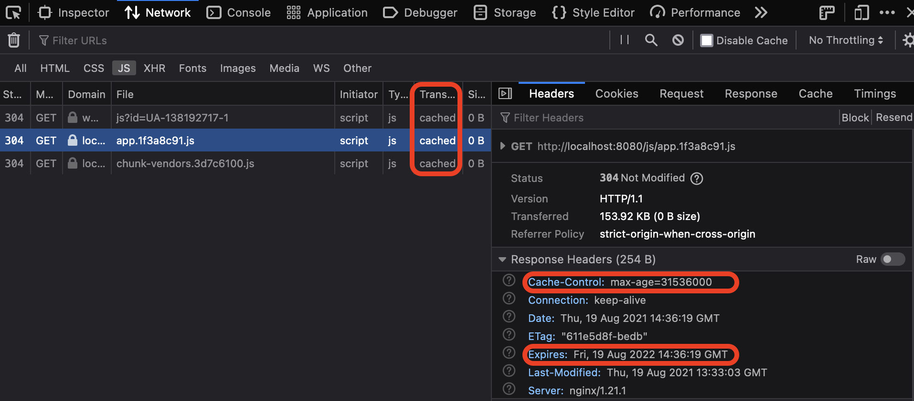
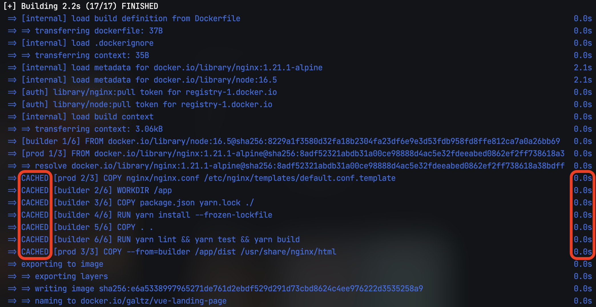
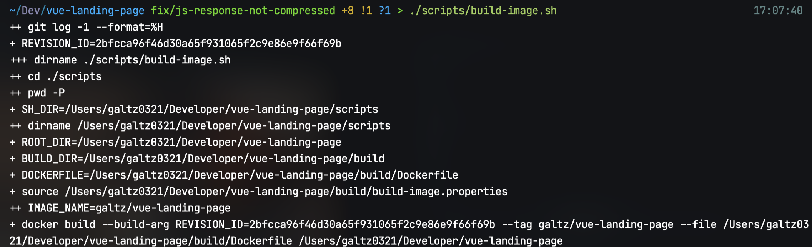
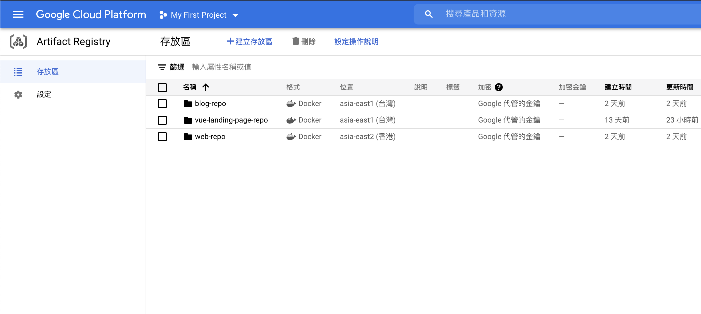
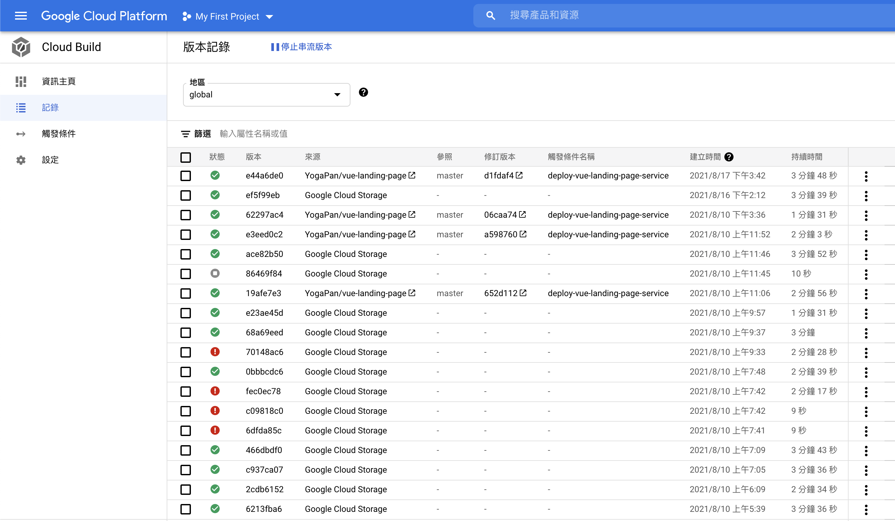
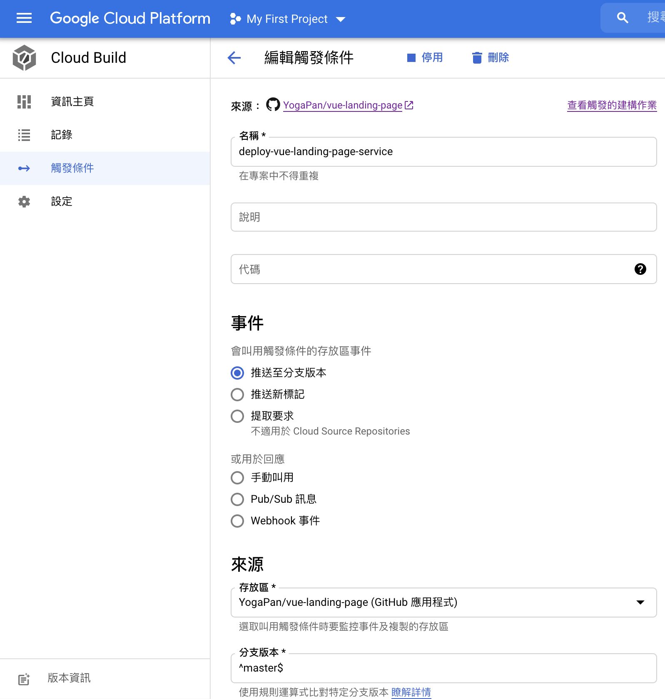
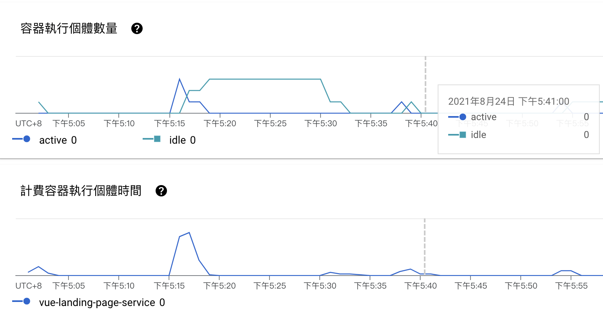

## Table of Contents

```toc

```

## 1. 撰文動機

筆者曾經協助過區塊鏈工程師製作 landing page，不過當時僅使用 Vue 進行 UI 的簡單開發，沒有打包 Docker image 就直接轉交他人進行部署了。恰好最近需要練習 Nginx、Docker、Google Cloud Platform 等前端工程師較少接觸的領域，所以把[當年的專案](https://github.com/YogaPan/vue-landing-page)翻出來，使用上述技術進行部署練習。

## 2. Nginx

由於不需要處理 WebAPI 請求，所以我們直接使用 [Nginx](http://nginx.org/en/) 作為靜態資源 web server，針對 HTTP request 回應對應的靜態資源，並進行 cache、compression 壓縮等處理，在設定上有許多眉眉角角，以下我們就一一拆解。

### 2.1 Handle Request URL

設定 [listen](http://nginx.org/en/docs/http/ngx_http_core_module.html#listen) 、 [root](http://nginx.org/en/docs/http/ngx_http_core_module.html#root) 以及 [location](http://nginx.org/en/docs/http/ngx_http_core_module.html#location) ，根據 request URL 回應對應路徑的檔案。若為 SPA，則需要設定 [try_files](http://nginx.org/en/docs/http/ngx_http_core_module.html#try_files) 進行內部重新導向至 `index.html`，將決定頁面渲染的邏輯交由前端的 [History API](https://developer.mozilla.org/en-US/docs/Web/API/History_API) 來決定：

```nginx
server {
  listen $PORT; # 在 Nginx image 內注入的環境變數，後面章節會提到。
  root /usr/share/nginx/html;
  location / {
    try_files $uri /index.html;
  }
}
```

需要特別注意 `.` 開頭的 hidden file 通常不希望能被存取，為保險起見加上 [deny](http://nginx.org/en/docs/http/ngx_http_access_module.html#deny) 規則：

```nginx
server {
  location ~ /\. {
    deny all;
  }
}
```

### 2.2 Compression

利用 [ngx_http_gzip_module](http://nginx.org/en/docs/http/ngx_http_gzip_module.html) 針對 text-based 的檔案進行壓縮：

```nginx
server {
  # 預設僅開啟 `text/html` MIME Types Response 的壓縮
  gzip on;
  # 指定除 `text/html` 以外也需被壓縮的 MIME types response
  gzip_types text/plain text/css text/xml text/javascript application/javascript  application/xml;
  # add `Vary: Accept-Encoding` header
  # reference: https://developer.mozilla.org/en-US/docs/Web/HTTP/Caching#varying_responses
  gzip_vary on;
  # compression level, 1 ~ 9 可供選擇
  gzip_comp_level 1;
  # 根據 response header `Content-Length` 決定是否進行壓縮
  gzip_min_length 10240;
}
```

在 Devtool 中可以看 Gzip 為我們節省了許多網路流量：



### 2.3 HTTP Cache

針對 [webpack long-term cache](https://developers.google.com/web/fundamentals/performance/webpack/use-long-term-caching#split-the-code-into-routes-and-pages) 產出的 `css/js/image` 設定極長的 [expires](http://nginx.org/en/docs/http/ngx_http_headers_module.html#expires) ，利用 cache 達到增進效能、減少 server 網路流量的效果：

```nginx
server {
  location ~* \.(css|js)$ {
    expires 365d;
  }

  location ~* \.(jpg|jpeg|png|gif)$ {
    expires 365d;
  }
}
```



以上僅是很基本的設定，若要對效能進行調校、改善開發環境，可以參考以下連結：

1. [GitHub - denji/nginx-tuning: NGINX tuning for best performance](https://github.com/denji/nginx-tuning)
2. [Github - Sample Nginx config with sane caching settings for modern web development](https://gist.github.com/philipstanislaus/654adafad91efb6de230845b5bdeae61)

## 3. Docker

[Docker](https://www.docker.com/) 協助建置、測試並且打包成一個獨立網頁應用，只需建置一次 Docker image，即可在任意機器、平台、服務上執行，避免環境設定、套件安裝等繁雜工作。

### 3.1 Dockerfile

撰寫 `Dockerfile` 強烈建議要看過這篇 [Intro Guide to Dockerfile Best Practices](https://www.docker.com/blog/intro-guide-to-dockerfile-best-practices/) ，正確的撰寫方式可以使用 cache 大大減少 build time，也減少 image size 避免不必要的網路傳輸。

這裡需要兩個 Base Image，用 [multi-stage](https://docs.docker.com/develop/develop-images/multistage-build/) 的方式進行 docker build：

1. [Node image](https://hub.docker.com/_/node) ：用來安裝相依套件，測試後產出 `dist`。
2. [Nginx image](https://hub.docker.com/_/nginx) ：將 `dist`、`nginx.conf` copy 至 Nginx 會讀取的 folder 底下，並設定監聽 port 號。

```Dockerfile
FROM node:16.5 as builder

WORKDIR /app

COPY package.json yarn.lock ./
RUN yarn install --frozen-lockfile

COPY . .
RUN yarn lint && yarn test && yarn build

FROM nginx:1.21.1-alpine as prod
ARG REVISION_ID
LABEL revision_id=${REVISION_ID}

COPY nginx/nginx.conf /etc/nginx/templates/default.conf.template
COPY --from=builder /app/dist /usr/share/nginx/html

ENV REVISION_ID=${REVISION_ID}
```

以上 `Dockerfile` 有幾個小細節：

1. `REVISION_ID`：作為 debug 用途，可以快速找出這顆 image 對應的 git commit。
2. 將 `nginx.conf` copy 至 `/etc/nginx/templates` 底下：當 container 啟動時會將**環境變數**注入 `/etc/nginx/templates` 底下的設定檔後搬移至 `/etc/nginx/conf.d/` 中。我們在前面已經在 `nginx.conf` 中有指定監聽 `PORT` 這個環境變數。

### 3.2 Build Docker Image

執行以下指令建置 docker image：

```shell
docker build \
  --build-arg REVISION_ID="$(git log -1 --format=%H)" \
  --tag galtz/vue-landing-page \
  .
```

重複執行時 Docker build 會使用 cache，只要不修改 `package.json` 就不會執行 `yarn install`，節省了不少時間！



Run Docker image：

```shell
docker run \
  -dp 8080:8080 -e "PORT=8080" \
  --name vue-landing-page \
  galtz/vue-landing-page
```

### 3.3 Build Scripts

每次都需要打這一大串指令相當不直覺也超麻煩，這裡稍作整理將 build image 所需要檔案和腳本整理如下：

```text
vue-landing-page/
├── build/
│   ├── build-image.properties
│   └── Dockerfile
└─── scripts/
    ├── build-image.sh
    └── run-image.sh
```

將未來可能需要進行調整的 image name 放入 `build/build-image.properties` 中：

```properties
IMAGE_NAME=galtz/vue-landing-page
```

`scripts/build-image.sh`：

```shell
#!/bin/bash

set -ex

REVISION_ID="$(git log -1 --format=%H)"
SH_DIR="$(cd "$(dirname "$0")"; pwd -P)"
ROOT_DIR="$(dirname $SH_DIR)"
BUILD_DIR="${ROOT_DIR}/build"
DOCKERFILE="${BUILD_DIR}/Dockerfile"

source ${BUILD_DIR}/build-image.properties

docker build \
  --build-arg REVISION_ID=${REVISION_ID} \
  --tag ${IMAGE_NAME} \
  --file ${DOCKERFILE} \
  $ROOT_DIR
```

這邊有一個 shell script 的小訣竅： `set -ex`，`-e` 代表有某一條指令失敗了就不會繼續往下執行； `-x` 則是印出每條指令和變數，debug 起來特別方便，效果如下：


`scripts/run-image.sh`：

```shell
#!/bin/bash

set -ex

SH_DIR="$(cd "$(dirname "$0")"; pwd -P)"
ROOT_DIR=$(dirname $SH_DIR)
BUILD_DIR=$ROOT_DIR/build
CONTAINER_NAME=vue-landing-page
PORT=8080

source $BUILD_DIR/build-image.properties

docker run \
  -dp ${PORT}:${PORT} -e "PORT=${PORT}" \
  --name $CONTAINER_NAME \
  $IMAGE_NAME
```

接下來就能透過腳本建置後運行：

```shell
./scripts/build-image.sh && ./scripts/run-image.sh
```

## 4. Google Cloud Platform

確認在本機運行 container 沒問題後，下一步就是要讓全世界能夠看到我們的網站！基本上不可能為了搭建這個網站就去自建機房處理設備、網路、儲存、效能、備份、安全性等問題，所以這裡選擇使用 [Google Cloud Platform](https://cloud.google.com/gcp)（以下簡稱 GCP） 提供的服務，協助我們整合 CI/CD 自動進行建置、測試、部署至雲端，讓我們有更多餘力專注在開發上。

開始使用前要先建立 GCP 的 [project](https://cloud.google.com/resource-manager/docs/creating-managing-projects) 並且設定好付款資訊，接著下載 [Google SDK](https://cloud.google.com/sdk/docs/install) 即可在本機進行操作，官網有詳細文件，這裡不再贅述。

### 4.1 Artifact Registry

[Artifact Registry](https://cloud.google.com/artifact-registry) 讓你能夠儲存 Docker image 或各種語言的 package，如：npm、 maven、python 等，並且能夠輕鬆和其他 GCP 服務如 Cloud Build、Cloud Run 整合。

這裡我們新增一個 repositories 並指定 `--repository-format=docker`：

```shell
gcloud artifacts repositories create web-repo \
  --repository-format=docker \
  --location=asia-east1
```

列出所有 repositories，應該可以看到剛剛新增的 repositories，接下來我們的 Docker image 都會存放在這裡：

```shell
gcloud artifacts repositories list
```

也可以至 [Artifact Registry Console](https://console.cloud.google.com/artifacts) 瀏覽所有 repositories 和底下的 Docker images：


由於 Artifact Registry 是不能被所有人任意存取的，本機要存取這些 Docker image 必須進行以下[設定](https://cloud.google.com/sdk/gcloud/reference/auth/configure-docker)：

```shell
gcloud auth configure-docker asia-east1-docker.pkg.dev
```

計費方式參考 [Artifact Registry Pricing](https://cloud.google.com/artifact-registry/pricing#pricing_overview)，基本上只要遵守以下幾點就不會有費用產生：

1. 避免使用超過 0.5 GB 的 Storage。
2. Google 產品內部網路輸出不要跨區域。
3. 不要產生 Google 產品外部的網路輸出。

### 4.2 Cloud Build

[Cloud Build](https://cloud.google.com/build) 是協助我們持續建構、測試和部署的 CI/CD 服務，透過設定 [Cloud Build configuration file](https://cloud.google.com/build/docs/build-config-file-schema) 內的 `steps` 指揮 Cloud Build 完成任務。[費用](https://cloud.google.com/build/pricing)方面只要是使用預設的機器即享有每日 120 分鐘免費額度。

#### 4.2.1 Local Manual Build

通常習慣將設定檔取名 `cloudbuild.yaml` 並放在專案根目錄，以下簡單解釋各欄位作用：

- `steps`：指定 Cloud Build 的任務，每個步驟都是由 `docker run` 來執行。
- `name` ：指定要使用什麼 [cloud builder](https://cloud.google.com/build/docs/cloud-builders)，這些 cloud builder 都是 container image。
- `args` ：指定 cloud builder 執行的參數。
- `images`：指定 images 名稱，在所有 steps 完成後會自動 push 至 Artifact Registry 儲存。
- `${PROJECT_ID}`：執行時代換為目前的 `PROJECT_ID`，參考 [Default Substitutions](https://cloud.google.com/build/docs/configuring-builds/substitute-variable-values#using_default_substitutions)。
- `${REVISION_ID}`：在 Cloud Build 執行時代換成 Trigger 建置的 Git Commit SHA，參考 [Default Substitutions](https://cloud.google.com/build/docs/configuring-builds/substitute-variable-values#using_default_substitutions)。

`cloudbuild.yaml`：

```yaml
steps:
  - name: 'gcr.io/cloud-builders/docker'
    args:
      - 'build'
      - '--build-arg=REVISION_ID=${REVISION_ID}'
      - '--build-arg=NGINX_PORT=${_NGINX_PORT}'
      - '--tag=asia-east1-docker.pkg.dev/${PROJECT_ID}/vue-landing-page-repo/vue-landing-page:latest'
      - '--file=./build/Dockerfile'
      - '.'
images:
  - 'asia-east1-docker.pkg.dev/${PROJECT_ID}/vue-landing-page-repo/vue-landing-page:latest'
```

接著使用 [gcloud builds submit](https://cloud.google.com/sdk/gcloud/reference/builds/submit) 指令，將建置 Docker image 的任務提交給 Cloud Build。老樣子，為了避免指令落落長，我們撰寫 `cloud-build.sh` 腳本方便本機進行測試：

```shell
#!/bin/bash

set -ex

REVISION_ID="$(git log -1 --format=%H)"
SH_DIR="$(cd "$(dirname "$0")"; pwd -P)"
ROOT_DIR=$(dirname $SH_DIR)
BUILD_DIR="${ROOT_DIR}/build"

source ${BUILD_DIR}/build-image.properties

cd $ROOT_DIR
gcloud builds submit \
  --config cloudbuild.yaml \
  --substitutions=REVISION_ID=${REVISION_ID}
```

執行腳本建置完成後，就可以到 [Viewing build logs](https://console.cloud.google.com/cloud-build/builds)這裡查看 build results：


若有 performance 上的考量需使用 Docker image cache，可以閱讀官方這篇 [Best practices for speeding up builds](https://cloud.google.com/build/docs/speeding-up-builds)，其中的 [Using a cached Docker image](https://cloud.google.com/build/docs/speeding-up-builds#using_a_cached_docker_image) 方法用在 multi-stage 的建置會遇到無法完全利用 cache 的問題，需要拆分成多顆 image，參考 [garethr/multi-stage-build-example/cloudbuild.yaml](https://github.com/garethr/multi-stage-build-example/blob/master/cloudbuild.yaml)。

#### 4.2.2 Trigger Cloud Build by Github Push Event

我們不希望每次都由手動來觸發 Cloud Build，應該要將流程自動化，當程式碼通過測試和 review 進到 master branch 後馬上觸發。Trigger（觸發條件） 能夠根據 push to a branch、push new tag 以及 pull request 等 event 觸發 Cloud Build 執行，和 Github 的整合官方有[詳細的步驟](https://cloud.google.com/build/docs/automating-builds/build-repos-from-github)，這裡不再贅述。



### 4.3 Cloud Run

[Cloud Run](https://cloud.google.com/run) 是 GCP 提供的 [serverless](https://cloud.google.com/serverless) 服務，只需透過 yaml 設定即可部署、運行 containerized app，完全不需管理 server infrastructure，讓我們能專注在開發上。它具備 [autoscaling](https://en.wikipedia.org/wiki/Autoscaling) 的能力，根據當下 traffic 來分配計算資源，在沒有 request 時 scale-to-zero。這意味著我們的網站 [handle request 時才計費](https://cloud.google.com/run/pricing#billable-time)：

```text
          request1            response1
                |   request2     ʌ      response2
                |        |       |       ʌ
                v........|......./       |
                         |               |
                         v.............../

|-----FREE-----|----------BILLED----------|----FREE...
```

以上圖表節錄自 [Google Cloud Run - FAQ](https://github.com/ahmetb/cloud-run-faq) by [Ahmet Alp Balkan](https://github.com/ahmetb) ，licensed under [Creative common Attribution 4.0 International (CC BY 4.0)](https://creativecommons.org/licenses/by/4.0/) 。最新、最詳細的計費方式請以官方 [Cloud Run Pricing](https://cloud.google.com/run/pricing) 為準。

可以看到當沒有網路請求時，運行的 container 數量為 0：


哇！聽起來好棒棒！不過也有幾點值得注意：

1. [cold start](https://github.com/ahmetb/cloud-run-faq#cold-starts)：如果長時間沒有接收到請求，那麼下一次請求會有額外的延遲。不過這對於我們單純的靜態網站幾乎不會造成什麼影響。
2. `WebSocket`：由於 WebSocket 連線是長時間持續的，可能會導致用量增加，你要花的錢錢也就變多了！還有很多眉眉角角建議直接參考官方文件：[Using WebSockets](https://cloud.google.com/run/docs/triggering/websockets)。

接下來在 `cloudbuild.yaml` 加入新的 `steps`，成功 build image 後使用 [Cloud SDK](https://github.com/GoogleCloudPlatform/cloud-sdk-docker) image 部署至 Cloud Run：

```yaml
steps:
  - name: 'gcr.io/cloud-builders/docker'
    args:
      - 'build'
      - '--build-arg=REVISION_ID=${REVISION_ID}'
      - '--tag=asia-east1-docker.pkg.dev/${PROJECT_ID}/vue-landing-page-repo/vue-landing-page:latest'
      - '--file=./build/Dockerfile'
      - '.'
  - name: 'gcr.io/google.com/cloudsdktool/cloud-sdk'
    entrypoint: gcloud
    args:
      - 'run'
      - 'deploy'
      - 'vue-landing-page-service'
      - '--image=asia-east1-docker.pkg.dev/${PROJECT_ID}/vue-landing-page-repo/vue-landing-page'
      - '--region=asia-east1'
      - '--platform=managed'
images:
  - 'asia-east1-docker.pkg.dev/${PROJECT_ID}/vue-landing-page-repo/vue-landing-page:latest'
```

接下來只需要透過經程式碼 push、merge 至 Github master branch，就會自動觸發 Cloud Build 並且部署至 Cloud Run。

## 5. 結語

這次主要是作為**練習用途**，在工作上很難有所謂的「純前端工程師」🙄，各式各樣的技術都應涉略，可以減少往後和後端、SRE 小夥伴協作溝通的成本。

在服務的選擇上，僅單純要部署靜態網站且不需要進行複雜設定的話，我會優先選擇 [Netlify](https://www.netlify.com/)，使用更為簡單、輕鬆整合 CI/CD、以及 [Deploy Previews](https://docs.netlify.com/site-deploys/deploy-previews/) 的功能，如本 Blog 就是使用 Netlify 提供的服務進行建置和部署。另外還有其他選項，如 [Firebase Hosting](https://firebase.google.com/docs/hosting)。

部署完了還需要 [Custom Domain](https://cloud.google.com/run/docs/mapping-custom-domain)、利用 [Cloud Logging](https://cloud.google.com/logging) 監控以及知道出事時要怎麼 [Rollback](https://cloud.google.com/run/docs/rollouts-rollbacks-traffic-migration)，礙於篇幅留到下一篇文章再介紹。

## 6. 參考資料

除官方文件外，撰寫本篇文章時參考了以下資源：

1. [Optimizing Encoding and Transfer Size of Text-Based Assets](https://developers.google.com/web/fundamentals/performance/optimizing-content-efficiency/optimize-encoding-and-transfer)
2. [用基礎雲端概念來了解 GCP 的好](https://www.mile.cloud/zh/resources/blog/44/%E7%94%A8%E5%9F%BA%E7%A4%8E%E9%9B%B2%E7%AB%AF%E6%A6%82%E5%BF%B5%E4%BE%86%E4%BA%86%E8%A7%A3%2520GCP%2520%E7%9A%84%E5%A5%BD)
3. [CI/CD (持續性整合 / 部署) - 因為懶，所以更要 CI/CD！概念講解！ | Kenny’s Blog](https://blog.kennycoder.io/2020/04/07/CI-CD-%E6%8C%81%E7%BA%8C%E6%80%A7%E6%95%B4%E5%90%88-%E9%83%A8%E7%BD%B2-%E5%9B%A0%E7%82%BA%E6%87%B6%EF%BC%8C%E6%89%80%E4%BB%A5%E6%9B%B4%E8%A6%81CI-CD%EF%BC%81%E6%A6%82%E5%BF%B5%E8%AC%9B%E8%A7%A3%EF%BC%81/)
4. [Journey to Serverless on Google Cloud Platform | by Timothy | Google Cloud - Community | Medium](https://medium.com/google-cloud/journey-to-serverless-on-google-cloud-platform-67b8d392ffa2)
5. [GitHub - ahmetb/cloud-run-faq: Unofficial FAQ and everything you’ve been wondering about Google Cloud Run.](https://github.com/ahmetb/cloud-run-faq#are-websockets-supported-on-cloud-run)
6. [GitHub - steren/awesome-cloudrun: 👓 ⏩ A curated list of resources about all things Cloud Run](https://github.com/steren/awesome-cloudrun)
