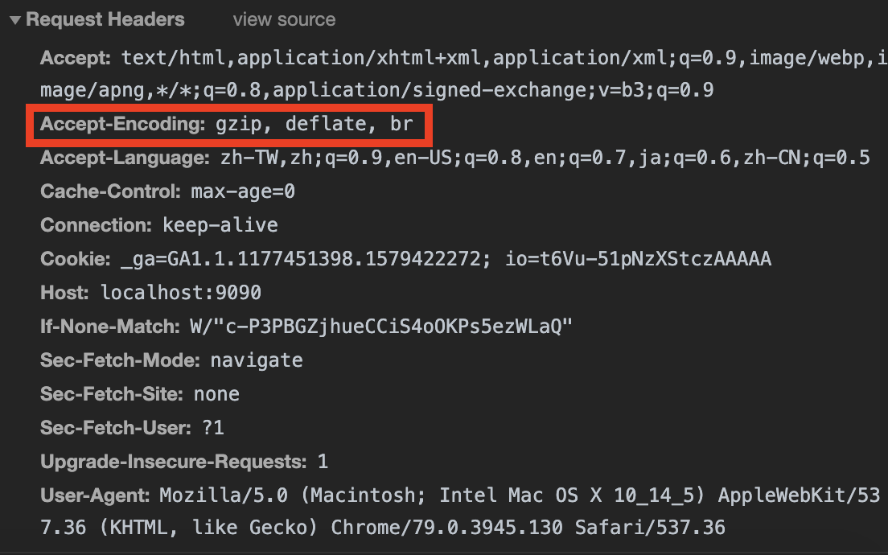

## 什麼是 Compression ？

[根據 Ilya Grigorik 的總整理](https://developers.google.com/web/fundamentals/performance/optimizing-content-efficiency/optimize-encoding-and-transfer):

- Compression is the process of encoding information using fewer bits.
- GZIP performs best on text-based assets: CSS, JavaScript, HTML.
- All modern browsers support GZIP compression and will automatically request it.

不過也不是說任何資源我都無腦亂壓一通，根據 [ASP.NET Core 中的回應壓縮 | Microsoft Docs](https://docs.microsoft.com/zh-tw/aspnet/core/performance/response-compression?view=aspnetcore-3.1)：

You shouldn't compress natively compressed assets, such as PNG files.
If you attempt to further compress a natively compressed response,
any small additional reduction in size and transmission time will likely be overshadowed by the time it took to process the compression.
Don't compress files smaller than about 150-1000 bytes (depending on the file's content and the efficiency of compression).
The overhead of compressing small files may produce a compressed file larger than the uncompressed file.

## HTTP Header

在開始看 http header 之前，先來複習一下主動協商 (Proactive Negotiation)：

User Agent 發送 `期望或偏好的` representation，使 Server 根據該偏好資訊，使用適當的演算法選擇 representation。
但 server 仍可能回應非預期的 representation, 或是 [406 Not acceptable](https://developer.mozilla.org/en-US/docs/Web/HTTP/Status/406)、[415 Unsupported Media Type](https://developer.mozilla.org/zh-TW/docs/Web/HTTP/Status/415)。

[Accept-Encoding](https://developer.mozilla.org/en-US/docs/Web/HTTP/Headers/Accept-Encoding): `期望` server 使用的編碼方式。

```http
Accept-Encoding: gzip, deflate, br
```

[Content-Encoding](https://developer.mozilla.org/en-US/docs/Web/HTTP/Headers/Content-Encoding): 指出應用於表示的編碼方式，以指示瀏覽器使用相應的解碼機制來獲取資料。

```http
Content-Encoding: gzip
```

其中 `br` 代表 [botli](https://github.com/google/brotli)， 是 google 推出的壓縮標準

上面有提到，現代的瀏覽器都會自動在 Request Header 要求 Server 使用壓縮：



## Expressd Middleware

透過 [compression middleware](https://github.com/expressjs/compression)，可以對 response 進行 `deflate` 或 `gzip` 壓縮：

```js
const express = require('express')
const compression = require('compression')

const app = express()

app.use(compression()) // 可以給定參數 `threshold`，預設為 1kb

app.get('/', (req, res) => {
  // ...
})
```

## Dotnet Core Middleware

透過 [NuGet Gallery | Microsoft.AspNetCore.ResponseCompression 2.2.0](https://www.nuget.org/packages/Microsoft.AspNetCore.ResponseCompression/)，可以對 response 進行 `brotli` 或 `gzip` 壓縮。

Donet Core 3.0 開始預設使用 `Brotli` 演算法壓縮：

```c#
using Microsoft.AspNetCore.ResponseCompression;

public class Startup
{
    public void ConfigureServices(IServiceCollection services)
    {
        services.AddResponseCompression();
    }

    public void Configure(IApplicationBuilder app)
    {
        app.UseResponseCompression();
    }
}
```

也可以修改設定，關閉 `Brotli`，改用 `Gzip`:

```c#
using Microsoft.AspNetCore.ResponseCompression;
using static System.IO.Compression.CompressionLevel;

public class Startup
{
    public void ConfigureServices(IServiceCollection services)
    {
        services.Configure<GzipCompressionProviderOptions>(options => options.Level = Optimal);
        services.AddResponseCompression(options =>
        {
            options.Providers.Add<GzipCompressionProvider>();
        });
    }

    public void Configure(IApplicationBuilder app)
    {
        app.UseResponseCompression();
    }
}
```

## 參考資料

- [Optimizing Encoding and Transfer Size of Text-Based Assets](https://developers.google.com/web/fundamentals/performance/optimizing-content-efficiency/optimize-encoding-and-transfer)
- [HTTP 內容協商 (Content Negotiation) - NotFalse 技術客](https://notfalse.net/41/http-content-negotiation#-server-driven)
- [HTTP 內容類型 (Content-Type) & 內容編碼 (Content-Encoding) - NotFalse 技術客](https://notfalse.net/40/http-representation?subscribe=success#blog_subscription-9)
- [ASP.NET Core 中的回應壓縮 | Microsoft Docs](https://docs.microsoft.com/zh-tw/aspnet/core/performance/response-compression?view=aspnetcore-3.1)
- [expressjs/compression: Node.js compression middleware](https://github.com/expressjs/compression)
- [google/brotli: Brotli compression format](https://github.com/google/brotli)
