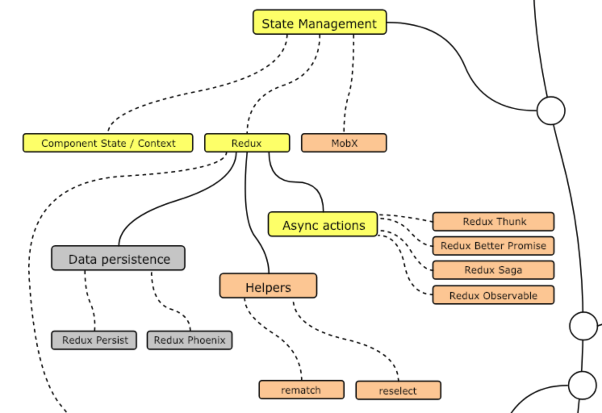
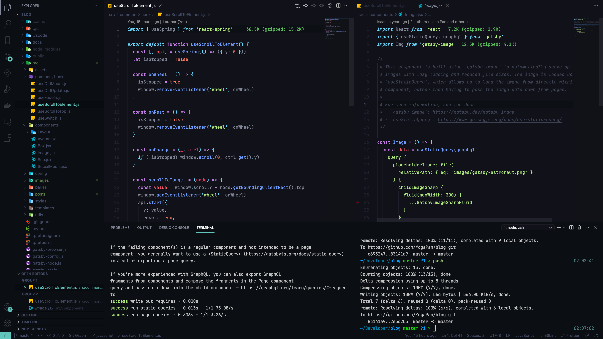
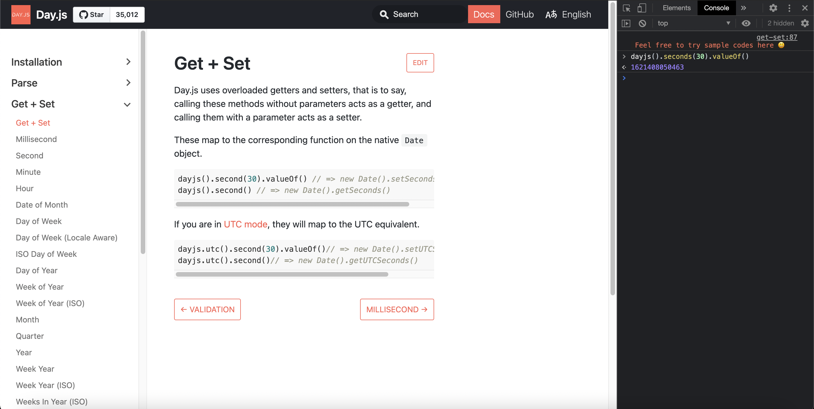

最近工作告一段落了。
希望以後要學習新技術時，也可以依照這種方式去學習，加快學習速度。

## 目錄

- [目錄](#目錄)
- [1. 確立學習方向](#1-確立學習方向)
  - [Roadmap](#roadmap)
  - [Awesome](#awesome)
- [2. 尋找學習資源](#2-尋找學習資源)
  - [官方文件](#官方文件)
  - [鐵人賽](#鐵人賽)
  - [閱讀開源程式碼](#閱讀開源程式碼)
- [3. 找個 Mentor](#3-找個-mentor)
- [4. 工欲善其事，必先利其器](#4-工欲善其事必先利其器)
  - [熟悉快捷鍵展現你的逼格](#熟悉快捷鍵展現你的逼格)
  - [用好看的 Theme 跟字體點燃你的中二魂](#用好看的-theme-跟字體點燃你的中二魂)
  - [找到自己的遊樂場](#找到自己的遊樂場)
- [5. Learning By Doing](#5-learning-by-doing)
- [6. 發揮自己的影響力](#6-發揮自己的影響力)
  - [幫別人 Code Review](#幫別人-code-review)
  - [協助他人](#協助他人)
  - [輸出文章](#輸出文章)

## 1. 確立學習方向

### Roadmap

勇者要闖關，絕對不會從新手村出發就去打王；法師要學習魔法，必須先搞清楚技能樹。學習程式技術也一樣，**要依照難度循序漸進，先建立基礎，再到融會貫通。**

現在 Github 上有很多整理好的 Roadmap ，並且每年都會固定更新。看書要先看目錄，**Roadmap 就是你要學習這門技術的魔法目錄**。

舉例，假設我今天要**學習 .NET, React.js 技術進行網頁開發**的話，我會先從範圍較大的部分下手，去看看**網頁開發**需要哪些技術和知識。於是我找到了這份：[Developer Roadmap](https://github.com/kamranahmedse/developer-roadmap)，可以看到 Frontend, Backend, DevOps 各個領域的技能樹。對於開發而言，我們可以重點關注 Frontend, Backend 即可。

之後再接著再來看 **.NET**, **React.js** 這兩項技術的 Roadmap：

1. [.NET Core Roadmap](https://github.com/MoienTajik/AspNetCore-Developer-Roadmap)
2. [React Roadmap](https://github.com/adam-golab/react-developer-roadmap)

哭喔，看到這裡你一定覺得要學的東西實在靠北多，一輩子的時間根本學不完。
對，你不可能學得完，你只要：

1. 讓自己能夠**大致理解技術的全貌**，方便擬定學習計畫、安排先後順序。
2. 理解需要解決特定問題有什麼解決方案。如果工作上沒有指定要使用哪一套，可以**先學習 Personal must know 的技術**，之後有需要再去看 Good to Know 和 Possibility 的部分。像是我想要做前端的**狀態管理**，我會先學基本的 **State/Context**, **Redux**, 其他方案像是 mobX，我知道有它的存在就好，需要時再來學也不遲。

### Awesome

每個語言都有自己的風土民情，光是套件、框架、生態系就眼花撩亂 (尤其是 Javascript 😅)。Github 有 Awesome 系列的 Repository，列出各場景下能夠使用的函示庫供你挑選。**我主要用來作為查詢用途，讓自己能夠挑選工具。**

像是個人正在學習的 .NET, React.js 就有很多很 Awesome 的工具：

- [GitHub - thangchung/awesome-dotnet-core: A collection of awesome .NET core libraries, tools, frameworks and software](https://github.com/thangchung/awesome-dotnet-core)
- [GitHub - enaqx/awesome-react: A collection of awesome things regarding React ecosystem](https://github.com/enaqx/awesome-react)
- [GitHub - sorrycc/awesome-javascript: 🐢 A collection of awesome browser-side JavaScript libraries, resources and shiny things.](https://github.com/sorrycc/awesome-javascript)

## 2. 尋找學習資源

### 官方文件

官方文件天下無雙，通常**最正確最詳盡的第一手資訊**都會在這裏。而且在很多官方文件都會有 **Getting Started** 的章節，剛入門時**跟著實作一次**通常都會有不錯的收穫。雖然通常都會支援多國語系，但是我個人仍然**強烈建議都以英文文件**為主。首先，和其他工程師溝通所使用的專有名詞通常是使用英文。再來很多中文的文件都參差不齊，也有可能會有人為、機器翻譯的錯誤。

像我要學 .NET, React.js，就會常常去看這幾分文件：

- [Microsoft .NET documentation](https://docs.microsoft.com/zh-tw/dotnet/fundamentals/): 很全面很詳細，但老實講很難啃得動 🥵
- [React Documentation](https://reactjs.org/): 裡面的 **Main Concepts** 和 **Hooks** 是基本中的基本。
- [Redux Documentation](https://redux.js.org/): 除了使用方式，裡面的 **Core Concept**、**Best Practice** 也很值得一看。
- [MDN Web Docs](https://developer.mozilla.org/)：嚴格來說這個不算是官方文件，不過這應該是每個 Web Developer 都會使用的資源。

### 鐵人賽

另一個很棒的學習資源就是鐵人賽的文章。裡面的文章都是經過另一個人融會貫通並經過整理後的產出，可能會有不一樣的想法或是切入點。成功完賽的系列都會有 30 篇的文章，**可以有系統的學習，避免破碎的吸收知識。**

像這篇 [ASP.NET Core 從入門到實用系列](https://ithelp.ithome.com.tw/users/20107461/ironman/1372)，對於我學習 .NET Core 幫助相當大。老實講官方的文件實在很難啃得動 😅，我反而喜歡閱讀這裡的文章。

### 閱讀開源程式碼

等到實力累積到一定程度後，可以嘗試閱讀開源的程式碼。看 Source Code 可以**跳脫自己習慣的思維模式**，看看大師們是如何**靈活運用語言特性**去解決問題。再來是這些程式碼通常很**簡潔卻意圖明確**。我們的目標就是**內化這些武功**，以後自己需要時可以隨時打出個一招半式。

我很推薦 [Redux](https://github.com/reduxjs/redux)，短小精悍，可以看到很多 functional programming, currying 的應用。其中 [Compose](https://github.com/reduxjs/redux/blob/master/src/compose.ts)、[ApplyMiddleware](https://github.com/reduxjs/redux/blob/master/src/applyMiddleware.ts) 真的是相當精妙。

## 3. 找個 Mentor

**Mentor 是你的職場導師，通常是在特定領域中有豐富的經歷、經驗和專長的前輩。**

我認為好的環境，遠比自己埋頭苦幹好要強的多。一個環境中最有影響力的就是身旁的人，而 Mentor 又會是影響你最多的人。**他能避免你一個人埋頭苦幹走歪路、能夠在你不知道對錯好壞時給予回饋**。

向 Mentor 學習就像是師徒關係，我們可以向 Mentor 汲取這些知識和歷練，突破自己的瓶頸。友善的工作環境下，**新人通常都會配備一位** 😜。如果沒有的話也可以自己厚臉皮去找一位前輩，麻煩他在有限的時間下指導自己。

這個角色並不是你老母。反而比較像那種留著長白鬍子山中智者，專們講一些幹話心法教育別人的那種。他應該：

1. **不過分保護，給予嘗試的空間**
2. **不給出標準答案，而是提出問題**
3. **不幫你規劃路徑，而是給出目標**

從自己的經驗來看，這也是一個**練習怎麼問問題**的機會。釐清問題的重點、提供對方須知讀上下文脈絡、用大家都聽得懂的名詞來表達需要大量的練習才能夠做到，這可以替未來和其他夥伴的合作能力打下基礎。

## 4. 工欲善其事，必先利其器

### 熟悉快捷鍵展現你的逼格

快捷鍵絕對是影響寫 Code 效率很大的一環，而且一波熟練的操作快捷鍵絕對能夠~~在他人面前展現自己的逼格~~。其中我認為重要的，就是能快速找到需要閱讀、修改程式碼段落的快捷鍵，以下以 VSCode 舉例：

- 開啟專案、檔案
  - `ctrl-r`: open project
  - `ctrl-w`: switch between windows
  - `ctrl-p`: open file
- 搜尋文字
  - `ctrl-f`: search
  - `ctrl-shift-f`: global search
- Code Navigation
  - `command + click`: 深入
  - `ctrl + -`: 彈出

多種編輯器之間的快捷鍵都有著不小的差異。像是我很熟悉 VSCode，那麼在使用 Rider 時可以透過安裝插件，來達到和 VSCode 極為相近的快捷鍵設定，讓**多種編輯器之間的操作儘量一致**。或者你是 Vim Mode 的高手，也可以在 VSCode, Rider 中安裝 Vim Mode 的套件。

### 用好看的 Theme 跟字體點燃你的中二魂

好看的開發工具，絕對會讓自己心情愉悅想要繼續學習。畢竟你會花一整天的時間盯著它們，請好好照顧你那迷人雙眼 👀。

Theme 我獨愛 [Material Theme](https://www.material-theme.com/)。至於字體，[JetBrains Mono](https://www.jetbrains.com/lp/mono/), [Fira Code](https://github.com/tonsky/FiraCode) 都是不錯的選擇。

### 找到自己的遊樂場

當學習時遇到不熟悉的語法、想快速嘗試一些作法的可行性時，可以直接借助一些工具來協助你：

1. **[.NET Fiddle](https://dotnetfiddle.net/)**: 讓你在瀏覽器直接執行 .NET。並且有儲存、分享的功能。
2. **[npm RunKit](https://npm.runkit.com/)**：直接你在瀏覽器嘗試各式各樣的 Node.js Package
3. **[CodeSandbox](https://codesandbox.io/)**：這工具真的沒在跟你 543。你只需要點點按鈕，就可以直接在瀏覽器內新建出 React, Vue, Angular 等前端框架的 sandbox，並且任意使用 npm package，讓你跳過繁瑣的設定。這些 sandbox 還可以儲存、分享、嵌入 iframe。
4. **瀏覽器 Console**：前端開發者一定都知道。不過很貼心的是有些套件官網幫你把套件載入好，讓你可以直接跟著文件試試手感。

## 5. Learning By Doing

你永遠不可能什麼事情都準備好了才開始。
你不用很厲害才能開始，而是要開始了才能很厲害？？？？？

1. 先從模仿開始
2. 挑戰稍微超出自己能力範圍的任務
3. 請人幫你 Code Review

## 6. 發揮自己的影響力

2. 嘗試撰寫分享文件、文章，能同時疏理腦中想法、知識
3. 能和別人解釋工具使用的場景、解決的問題、為什麼需要使用這個技術
4. 依照別人的立場、程度，給予不同的背景 Context、Feedback、Advise

### 幫別人 Code Review

可以參考 Google Code Review Guideline。

### 協助他人

### 輸出文章

就跟小鴨鴨除錯法一樣。在準備文章時，**也是在跟自己對話、整理腦中的知識。**

TODO
