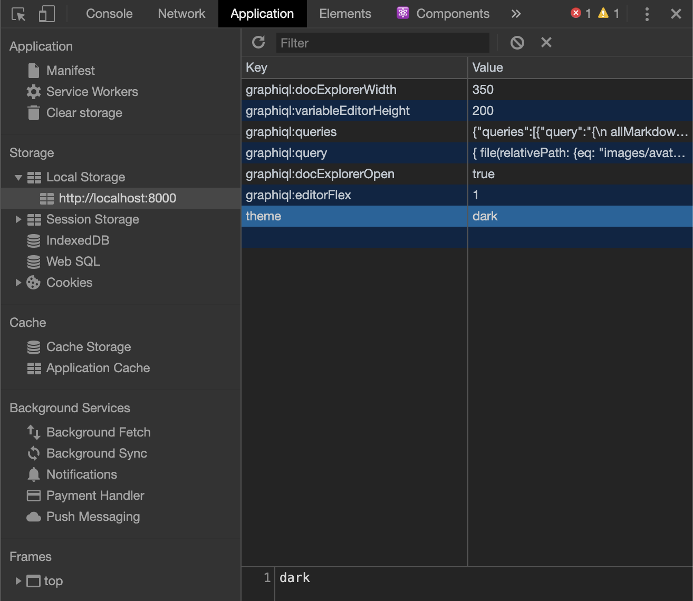

LocalStorage 是瀏覽器最簡單的資料儲存方法，儲存的資料不會隨著頁面重整或是瀏覽器關閉而丟失。這篇文章會紀錄 localStorage 的使用方式和情境，以及和 Cookie 的比較。

## 目錄

- [目錄](#目錄)
- [Web Storage API](#web-storage-api)
  - [轉型問題](#轉型問題)
- [DevTools](#devtools)
- [Life Cycle](#life-cycle)
- [Session Storage](#session-storage)
- [敏感資訊](#敏感資訊)
- [使用情境](#使用情境)
- [React Hooks](#react-hooks)
- [LocalForage](#localforage)
- [Reference](#reference)

## Web Storage API

[window.localStorage](https://developer.mozilla.org/en-US/docs/Web/API/Window/localStorage) 能夠讓妳存取當前 Domain 下的 [Storage](https://developer.mozilla.org/en-US/docs/Web/API/Storage) 物件。Storage 是用 Key Value 的形式儲存資料，可以直接用物件的方式操作:

```js
localStorage.theme = dark
console.log(localStorage.theme) // dark
```

但用以上方法操作會有[潛在的陷阱](https://2ality.com/2012/01/objects-as-maps.html)，所以建議呼叫以下四隻 API 進行操作:

- 設定資料: **[localStorage.setItem(key, value)](https://developer.mozilla.org/en-US/docs/Web/API/Storage/setItem)**
- 獲取資料: **let storageValue = [localStorage.getItem(key)](https://developer.mozilla.org/en-US/docs/Web/API/Storage/getItem)**
- 清除資料: **[localStorage.removeItem(key)](https://developer.mozilla.org/en-US/docs/Web/API/Storage/removeItem)**
- 清除所有資料: **[localStorage.clear()](https://developer.mozilla.org/en-US/docs/Web/API/Storage/clear)**

### 轉型問題

Storage 中的 key value 為 string 型態，所以如果給予非 string 的 key value 會自動轉型。

```js
localStorage.setItem('count', 41)
localStorage.getItem('count') // "41"

localStorage.setItem(666, 'devil')
localStorage.getItem('666') // "devil"

// Why???? 🤔🤔🤔🤔
localStorage.setItem('person', { name: 'Galtz', age: 23 })
localStorage.getItem('person') // [object Object]
```

上面範例中，儲存物件時遇到字串轉型問題，原因參考以下兩篇文章:

- https://developer.mozilla.org/en-US/docs/Web/JavaScript/Reference/Global_Objects/Object/toString
- https://medium.com/better-programming/what-is-object-object-in-javascript-object-prototype-tostring-1db888c695a4

解決方法： 使用 [JSON Object](https://developer.mozilla.org/en-US/docs/Web/JavaScript/Reference/Global_Objects/JSON) 進行轉換

```js
localStorage.setItem(
  'person',
  JSON.stringify({
    name: 'Galtz',
    age: 23,
  })
)

JSON.parse(localStorage.getItem('person')) // {name: "Galtz", age: 23}
```

## DevTools

在 **Application** -> **Storage** -> **Local Storage** 下，詳細使用方式參考 [Chrome Local Storage Devtools](https://developers.google.com/web/tools/chrome-devtools/storage/localstorage)。



## Life Cycle

不會隨著頁面重整或是瀏覽器關閉而丟失。除非呼叫 `localStorage.removeItem` 或是 `localStorage.clear`，否則永遠存在。

## Session Storage

Session Storage 和 Local Storage 除了生命週期不同以外幾乎一模一樣。Session Storage 的生命周期只存在瀏覽囂的單一分頁中 ，也就是另開新分頁的話 ，又是一個新的 sessionStorage ，預設無逾期時間，除非關閉該分頁、關閉瀏覽器等，sessionStorage 就會消失。

| 特性            | Cookie            | LocalStorage         | SessionStorage         |
| --------------- | ----------------- | -------------------- | ---------------------- |
| 生命週期        | 預設為 session    | 長生不老             | session                |
| 大小限制        | 4K                | 5MB 以上             | 5MB 以上               |
| 發送至 Server   | 每次              | No                   | No                     |
| 設置方法        | Header Set-Cookie | localStorage.setItem | sessionStorage.setItem |
| Client 讀取方法 | document.cookie   | localStorage.getItem | sessionStorage.getItem |

## 敏感資訊

安全性的問題我還不太暸解，可以先參考以下幾則討論

- https://stackoverflow.com/questions/3718349/html5-localstorage-security
- https://stackoverflow.com/questions/17280390/can-local-storage-ever-be-considered-secure/24677597#24677597
- https://stackoverflow.com/questions/44133536/is-it-safe-to-store-a-jwt-in-localstorage-with-reactjs

## 使用情境

TODO

## React Hooks

[react-use](https://github.com/streamich/react-use) 提供許多實用的 Hooks，其中包括 [useLocalStorage](https://github.com/streamich/react-use/blob/master/docs/useLocalStorage.md)，以下範例：

```js
import { useLocalStorage } from 'react-use'

const Demo = () => {
  const [value, setValue] = useLocalStorage('my-key', 'foo')

  return (
    <div>
      <div>Value: {value}</div>
      <button onClick={() => setValue('bar')}>bar</button>
      <button onClick={() => setValue('baz')}>baz</button>
    </div>
  )
}
```

## LocalForage

破萬星的 Library，API 幾乎和 LocalStorage 一模一樣：

```js
// Set a value with localStorage:
localStorage.setItem('key', JSON.stringify('value'))
doSomethingElse()

// The same code with localForage:
localforage.setItem('key', 'value').then(doSomethingElse)

// localForage also support callbacks:
localforage.setItem('key', 'value', doSomethingElse)
```

簡單的來說 [LocalForage](https://github.com/localForage/localForage) 做的是以下事情:

1. 如果 Browser 支援 [IndexedDB](https://developer.mozilla.org/en-US/docs/Web/API/IndexedDB_API/Using_IndexedDB)，就優先使用 IndexedDB 來儲存
2. 如果不支援，則使用 WebSQL
3. 如果連 WebSQL 都不支援，才會使用 LocaloStorage 來儲存資料。

LocalForage 解決了以下幾個問題:

1. 因為使用 IndexedDB ，效能較好、儲存大小幾乎沒有限制，且可以非同步操作
2. API 幾乎和 LocalStorage 一模一樣，解決 IndexedDB 不好上手的困擾
3. 自動進行 `JSON.parse()` 和 `JSON.stringify()`

## Reference

- [Using the Web Storage API - MDN](https://developer.mozilla.org/en-US/docs/Web/API/Web_Storage_API/Using_the_Web_Storage_API)
- [[第七週] 瀏覽器資料儲存 - Cookie、LocalStorage、SessionStorage](https://yakimhsu.com/project/project_w7_storage.html)
- [Cookie、LocalStorage、SessionStorage 差異 - Peggy Chan - Medium](https://medium.com/@bebebobohaha/cookie-localstorage-sessionstorage-%E5%B7%AE%E7%95%B0-9e1d5df3dd7f)
- [localForage/localForage: 💾 Offline storage, improved. Wraps IndexedDB, WebSQL, or localStorage using a simple but powerful API.](https://github.com/localForage/localForage)
