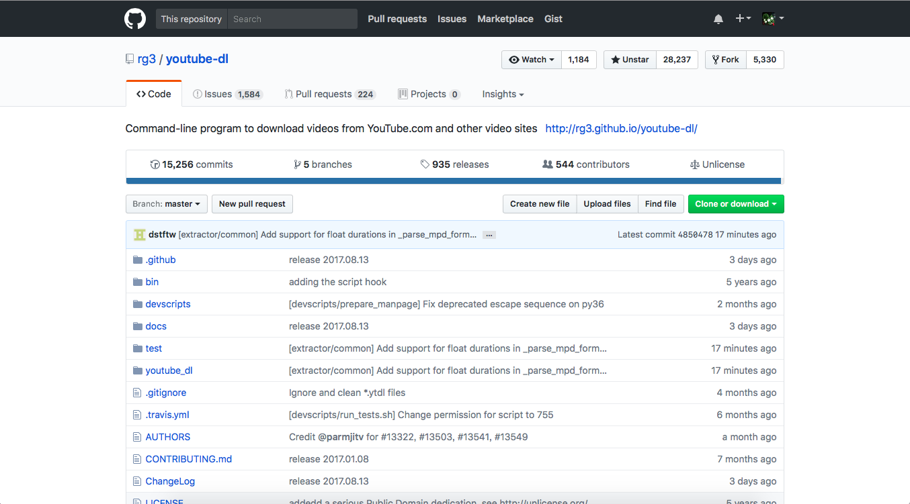
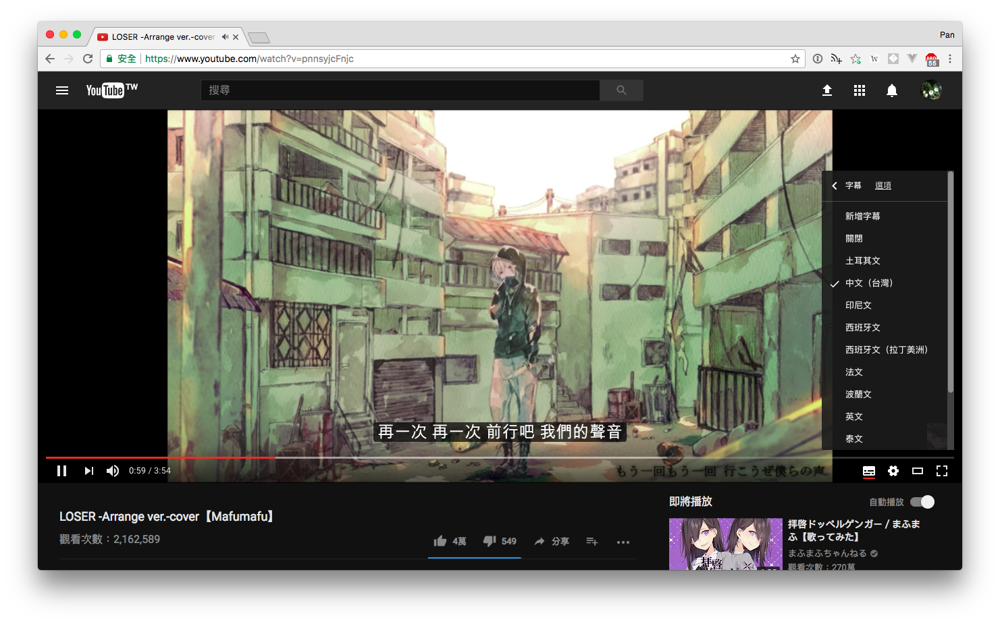
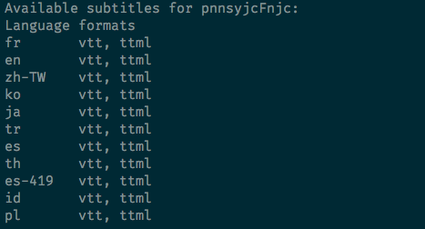
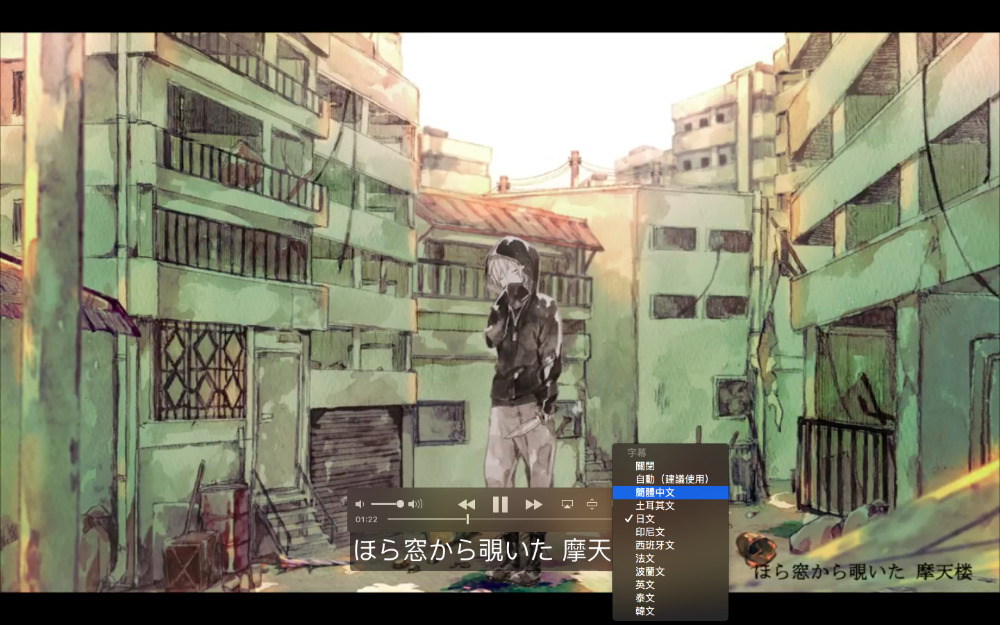
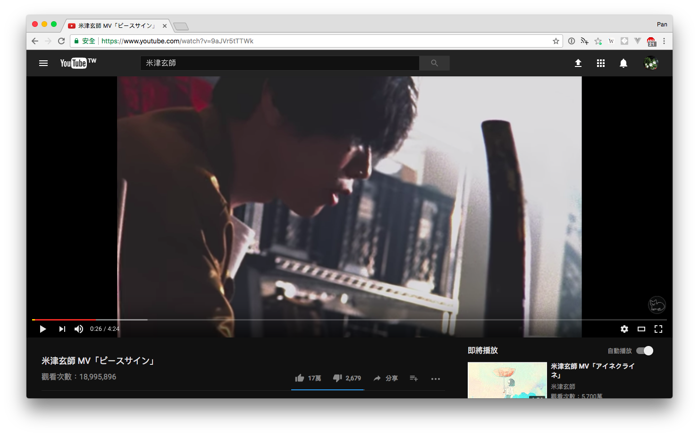
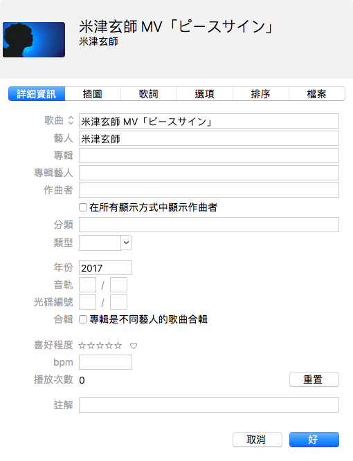

## Table of Contents

```toc
```

## youtube-dl 基本介紹



很多 YouTube 線上影片下載服務可能會有一些限制，像是

- 畫質、音質和檔案格式限制
- 下載頻率不能太密集、效率不夠好
- 無法下載整份清單(可能是進階會員才能使用)
- mp3 沒有圖片封面和詳細資訊
- 天殺的的一堆彈出式色情廣告

相反的，[youtube-dl](https://github.com/rg3/youtube-dl) 可以滿足你所有的需求：

- 畫質、音質沒有限制
- 幾乎支援所有影音格式
- 可以下載整份影片清單
- mp3 可以加入歌曲封面和專輯資訊
- 支援字幕、影片縮圖

<!--more-->

而且更猛的是，他不只可以下載 YouTube 的影片，甚至連 Facebook、Twitter、Xuite 上的影片都可以下載！
~~我絕對不會告訴你連 Pornhub 上的影片都可以輕鬆下載~~
~~但是前提是你要會用 Command Line 啦，呵呵~~

所有支援下載的網站清單:
https://github.com/rg3/youtube-dl/blob/master/docs/supportedsites.md

---

## 安裝

利用 mac 套件管理神器 [Homebrew](https://brew.sh) 來安裝

```shell
brew install youtube-dl
```

如果要使用 youtube-dl 的轉檔、嵌入字幕、提取音頻、加入專輯封面等等 `Post-processing` 的功能的話，則必須安裝[FFmpeg](https://www.ffmpeg.org)

```shell
brew install ffmpeg
```

## 下載影片

### 起手式：指定影片檔案格式

用 `-f` 或是 `--format` 指定影片格式，像是 `mp4, flv, mkv, webm`

Example: 下載 mp4 格式影片

```shell
youtube-dl -f mp4 <url>
```

### 品質

Youtube-dl 預設會下載最高畫質的影片，但也可以自己選擇想要的品質

Example: 下載解析度不高於 480p 的影片

```shell
youtube-dl -f 'bestvideo[height<=480][ext=mp4]+bestaudio/best[height<=480][ext=m4a]' <url>
```

### 嵌入字幕

`--list-subs` 列出所有可下載字幕的語言

- `--write-sub` 下載字幕
- `--embed-sub` 將字幕嵌入影片中
  _這兩個參數要一起合併使用_

- `--all-subs` 下載所有語言字幕
- `—-sub-lang LANGS` 指定字幕語言

例如我想要下載まふまふ cover 的這首『Loser』


首先用 `--list-subs` 列出所有可下載字幕的語言

```shell
youtube-dl --list-subs https://www.youtube.com/watch?v=pnnsyjcFnjc
```


發現 zh-TW(繁體中文)是可選的

下載影片並且嵌入中文字幕

```shell
youtube-dl --write-sub --embed-sub --sub-lang zh-tw -f mp4 https://www.youtube.com/watch?v=pnnsyjcFnjc
```

如果妳想要一次下載所有語言的字幕並且嵌入的話

```shell
youtube-dl --write-sub --embed-sub --all-subs -f mp4 https://www.youtube.com/watch?v=pnnsyjcFnjc
```

登登！現在下載下來的影片可以選擇字幕囉～


_注意_：只有`mp4, mkv, webm`這些影片格式可以嵌入字幕。

## 下載音樂

### 起手式: 指定音樂檔案類型

- `-x`或`--extract-audio`表示提取音頻
- `--audio-format`後面指定音頻檔案類型，像是 `mp3, wav, m4a, aac`

Example:

```shell
$ youtube-dl -x --audio-format mp3 <url>
```

### 縮圖和資料

- `--embed-thumbnail`加入專輯封面(其實就是 youtube 影片上的縮圖)
- `—-add-metadata`加入影片資訊

### Example

例如說我要下載米津玄師的這首「ピースサイン」


轉檔成 mp3 並且加入縮圖和影片資訊

```shell
youtube-dl -x --audio-format mp3 --embed-thumbnail --add-metadata https://www.youtube.com/watch?v=9aJVr5tTTWk
```

成功下載後可以看到上傳者和影片縮圖



## 下載 playlist

### 下載整份影片清單

```shell
youtube-dl -f mp4 <playlist-url>
```

_PS_: 除了影片網址的部分改成影片清單的網址，其他部分和下載影片一樣。

### 指定起點和終點

- `--playlist-start NUMBER`: 指定起點
- `—-playlist-end NUMBER`: 指定終點

從第三個影片開始下載到最後一個影片

```shell
youtube-dl --playlist-start 3 -f mp4 <playlist-url>
```

從第一個影片下載到倒數第二個影片

```shell
youtube-dl --playlist-end 2 -f mp4 <playlist-url>
```

從第三個影片開始下載到倒數第二個影片

```shell
youtube-dl --playlist-start 3 --playlist-end 2 -f mp4 <playlist-url>
```

## 輸出檔名

`-o, --output TEMPLATE`指定檔名輸出模板。預設是`%(title)s-%(id)s.%(ext)s`

直接指定檔名叫做`test.mp4`

```shell
youtube-dl -o "test.mp4" -f mp4 <url>
```

假如說我覺得影片 id 很煩很醜，我要把他去掉，只留下影片標題跟副檔名

```shell
youtube-dl -o '%(title)s.%(ext)s'
```

### 以下官方範例

Download YouTube playlist videos in separate directory indexed by video order in a playlist

```shell
youtube-dl -o '%(playlist)s/%(playlist_index)s - %(title)s.%(ext)s' https://www.youtube.com/playlist?list=PLwiyx1dc3P2JR9N8gQaQN_BCvlSlap7re
```

Download all playlists of YouTube channel/user keeping each playlist in separate directory:

```shell
youtube-dl -o '%(uploader)s/%(playlist)s/%(playlist_index)s - %(title)s.%(ext)s' https://www.youtube.com/user/TheLinuxFoundation/playlists
```

查詢更多模板參數:
https://github.com/rg3/youtube-dl#output-template

---

## 登入

如果有些影片要登入後才能觀看要怎麼辦呢？youtube-dl 還有支援帳戶登入的功能:

- `-u, --username USERNAME`
- `-p, --password PASSWORD`

Example:

```shell
youtube-dl -u 'username@gmail.com' -p 'password' https://www.youtube.com/?v=<video_id>
```

---

## 總結

以上的筆記為*超濃縮精華版*，youtube-dl 還有更多強大的功能和參數可供使用。如果要更詳細的參考文件，可以直接參考官方文件: https://github.com/rg3/youtube-dl

## Reference

- [舊 Blog](https://yogapan.github.io/2017/08/16/Youtube-dl%E6%BF%83%E7%B8%AE%E6%95%99%E5%AD%B8%E7%AD%86%E8%A8%98/)
