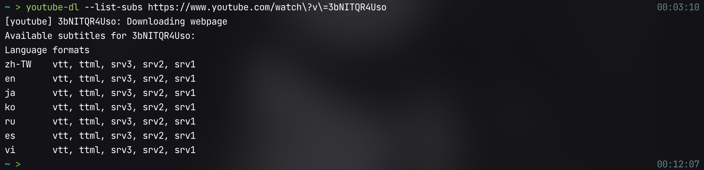

## Table of Contents

```toc
toHeading: 4
```

## 什麼是 youtube-dl


[youtube-dl](https://github.com/ytdl-org/youtube-dl) 是在 [Github](https://github.com/) 上擁有將近 10w 顆星星的 Python 開源專案。主樣功能是讓使用者透過 Command Line 來下載 YouTube 上的影片。

## 為什麼使用 youtube-dl?

現在已經有很多免費的線上 YouTube 影片下載工具了，為什麼還要使用沒有 UI 介面的 youtube-dl 呢？原因是這些**線上免費服務通常會有諸多限制**：

- 畫質、音質和檔案格式限制
- 下載頻率不能太密集、下載速率比你阿嬤還慢
- 無法下載整份清單
- 轉檔下載的 mp3 沒有封面圖片和詳細資訊
- 無法下載 CC 字幕
- 塞滿垃圾廣告

想要突破這些限制就必須付費。相反的，**[youtube-dl](https://github.com/ytdl-org/youtube-dl) 可以免費滿足你所有需求**：

- 畫質、音質沒有限制，支援多數常用影音格式
- 下載頻率沒有限制
- 可以下載整份影片清單
- 轉檔下載的 mp3 可以加入歌曲封面和專輯資訊
- 支援下載 CC 字幕、影片縮圖
- 不只 YouTube，也支援 Facebook、Twitter、Xuite、**PornHub**, **XVideos** 的影片下載。

[所有支援下載的網站清單](https://github.com/ytdl-org/youtube-dl/blob/master/docs/supportedsites.md)

## 如何使用 youtube-dl

### 安裝

利用 mac 套件管理神器 [Homebrew](https://brew.sh) 來安裝：

```shell
brew install youtube-dl
```

如果要使用 youtube-dl 的轉檔、嵌入字幕、提取音頻、加入專輯封面等等 `post-processing` 的功能的話，則必須安裝 [FFmpeg](https://www.ffmpeg.org)：

```shell
brew install ffmpeg
```

若是使用 Linux、Windows 平台，可以參考[官方安裝文件](https://github.com/ytdl-org/youtube-dl#installation)

### 下載影片

#### 格式和解析度

1. 列出可下載的影片檔案格式： 用 `-F` 或是 `--list-formats`
2. 格式: 用 `-f` 或是 `--format`
   1. 指定檔案格式 `mp4, flv, mkv, webm`，預設會下載最高畫質的影片
   2. 指定 `--list-formats` 所列出的 `format code`

#### 嵌入字幕

`--list-subs` 列出所有可下載字幕的語言

- `--write-sub` 下載字幕
- `--embed-sub` 將字幕嵌入影片中，只有 `mp4, mkv, webm` 這些影片格式可以嵌入字幕
- `--all-subs` 下載所有語言字幕
- `—-sub-lang LANGS` 指定字幕語言

注意：`--write-sub` 必須和 `--embed-sub` 合併使用

#### 使用流程

假如我想要下載這首超好聽的[竹內瑪莉亞 - Plastic Love](https://www.youtube.com/watch?v=3bNITQR4Uso)


先用 `-F` 或是 `--list-formats` 列出可下載的檔案格式

```shell
youtube-dl -F https://www.youtube.com/watch?v=3bNITQR4Uso
```


再用 `--list-subs` 列出所有可下載字幕的語言

```shell
youtube-dl --list-subs https://www.youtube.com/watch?v=3bNITQR4Uso
```



發現 `zh-TW` 是可選的，接著下載影片並且嵌入中文字幕

```shell
youtube-dl --write-sub --embed-sub --sub-lang zh-TW -f mp4 https://www.youtube.com/watch?v=3bNITQR4Uso
```

如果妳想要一次下載所有語言的字幕並且嵌入的話

```shell
youtube-dl --write-sub --embed-sub --all-subs -f mp4 https://www.youtube.com/watch?v=3bNITQR4Uso
```

打開下載下來的影片即可選擇字幕：


### 下載音樂

#### 指定音樂檔案類型

- `-x` 或 `--extract-audio` 表示提取音頻
- `--audio-format` 後面指定音頻檔案類型： `mp3, wav, m4a, aac`

#### 縮圖和歌曲資訊

- `--embed-thumbnail` 加入 youtube 影片縮圖
- `—-add-metadata` 加入歌曲資訊

例如說我要下載這首 [King Gnu - 白日](https://www.youtube.com/watch?v=ony539T074w)


轉檔成 mp3 並且加入縮圖和影片資訊

```shell
youtube-dl -x --audio-format mp3 --embed-thumbnail --add-metadata https://www.youtube.com/watch?v=ony539T074w
```

成功下載後可以看到 youtube 影片縮圖和歌曲資訊


### 下載 Playlist

除了影片網址的部分改成影片清單的網址，其他部分和下載影片一樣。

```shell
youtube-dl -f mp4 <playlist-url>
```

- `--playlist-start NUMBER`: 指定起點
- `—-playlist-end NUMBER`: 指定終點

從第二個影片開始下載到最後一個影片

```shell
youtube-dl --playlist-start 2 -f mp4 <playlist-url>
```

從第一個影片下載至第三個影片

```shell
youtube-dl --playlist-end 3 -f mp4 <playlist-url>
```

從第二個影片開始下載至第四個影片

```shell
youtube-dl --playlist-start 2 --playlist-end 4 -f mp4 <playlist-url>
```

## 進階功能

### 客製化輸出檔名

`-o, --output TEMPLATE` 指定檔名輸出模板。預設是 `%(title)s-%(id)s.%(ext)s`

假如說我覺得影片 id 很煩很醜，我要把他去掉，只留下影片標題跟副檔名

```shell
youtube-dl -o '%(title)s.%(ext)s'
```

也可以直接指定下載下來的影片檔名

```shell
youtube-dl -o "test.mp4" -f mp4 <url>
```

也可以根據 playlist、uploader 來決定輸出的檔名，以取自官方範例並稍微修改：

Download YouTube playlist videos in separate directory indexed by video order in a playlist

```shell
youtube-dl -o '%(playlist)s/%(playlist_index)s - %(title)s.%(ext)s' https://www.youtube.com/watch?v=Ab0l2s5p2f4&list=RDony539T074w
```


Download all playlists of YouTube channel/user keeping each playlist in separate directory:

```shell
youtube-dl -o '%(uploader)s/%(playlist)s/%(playlist_index)s - %(title)s.%(ext)s' https://www.youtube.com/user/TheLinuxFoundation/playlists
```

參考[模板參數](https://github.com/ytdl-org/youtube-dl#output-template)

### 登入

如果有些壞壞的影片要登入後才能觀看該怎麼辦呢？youtube-dl 還有支援帳戶登入的功能：

- `-u, --username USERNAME`
- `-p, --password PASSWORD`

## 總結

這篇文章是從我[舊 Blog 文章](https://yogapan.github.io/2017/08/16/Youtube-dl%E6%BF%83%E7%B8%AE%E6%95%99%E5%AD%B8%E7%AD%86%E8%A8%98/)經過整理後搬移過來的，相信以上的內容已經涵蓋了大多數的使用場景了。當然 youtube-dl 還有更多強大的功能和參數可供使用，參考官方文件: [youtube-dl](https://github.com/ytdl-org/youtube-dl)。
